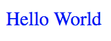
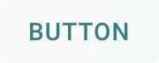
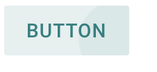

<!--docs:
title: "Getting Started"
layout: landing
section: docs
path: /docs/getting-started/
-->

# 入門ガイド

## クイックスタート (CDN)

最小限の構成で Material Components for the web を試すには、unpkg からコンパイル済みのオールインワン CSS と JS モジュールをロードします。

```html
https://unpkg.com/material-components-web@latest/dist/material-components-web.min.css
https://unpkg.com/material-components-web@latest/dist/material-components-web.min.js
```

そして MDC のマークアップを入れていきます。

```html
<button class="foo-button mdc-button">Button</button>
```

JavaScript をインスタンス化します。

```js
mdc.ripple.MDCRipple.attachTo(document.querySelector('.foo-button'));
```

## ローカルへのインストール

Material Components for the web は npm を使ってローカルにインストールできます。これは単一のオールインワンパッケージとして利用できます。

```
npm i material-components-web
```

もしくは個別のコンポーネントとして利用することもできます。

```
npm i @material/button @material/ripple
```

各パッケージは `dist` フォルダ内にコンパイル済みの CSS と JS を用意しています。コンパイル済み JS は UMD フォーマットにコンバートされており、ブラウザもしくは ES5 を使用可能なワークフロー内で直接利用できます。 Node.js コンテキスト内で `@ material/foo` を参照すると、`dist` 内のコンパイル済み JS が自動的に参照されます。

しかし、最適化のために、MDC Web の ES2015 モジュールと Sass を直接利用することをお勧めします。この概要を以下の手順で説明します。

## Sass と ES2015 での MDC Web の利用

この節ではどのように [MDC Web Node モジュールをインストールする](https://www.npmjs.com/org/material) のかを示し、[webpack](https://webpack.js.org/) 内の Node モジュールから Sass と JavaScript をバンドルする方法を示します。

最終的なコードや結果は [Material Starter Kit](https://glitch.com/~material-starter-kit) でも見ることができます。

> 注意: このガイドは Node.js と npm がローカルにインストールされていることを前提にしています。

### ステップ 1: Webpack の Sass の設定

`webpack-dev-server` を使ってどのように webpack が Sass と JavaScript をバンドルするのかを見ていきます。まず、`package.json` ファイルを作成するために `npm init` を実行します。完了したら、`scripts` セクションに `start` プロパティを追加します。

```json
{
  "scripts": {
    "start": "webpack-dev-server"
  }
}
```

以下の Node 依存関係がすべて必要です。:
- [webpack](https://www.npmjs.com/package/webpack): Sass と JavaScript をバンドルする
- [webpack-dev-server](https://www.npmjs.com/package/webpack-dev-server): 開発サーバー
- [sass-loader](https://www.npmjs.com/package/sass-loader): Sass ファイルを読み込み CSS にコンパイルする
- [node-sass](https://www.npmjs.com/package/node-sass): Node.js を Sass にバインドし、sass-loader と同等の依存関係を提供する
- [css-loader](https://www.npmjs.com/package/css-loader): CSS の @import と url() のパスを解決する
- [extract-loader](https://github.com/peerigon/extract-loader): `.css` ファイル内の CSS を抽出する
- [file-loader](https://github.com/webpack-contrib/file-loader): `.css` ファイルを公開 URL として扱う

次のコマンドでこれらすべてをインストールできます。

```
npm install --save-dev webpack@3 webpack-dev-server@2 css-loader sass-loader node-sass extract-loader file-loader
```

> 注意: 私たちは Webpack 3 を使うことを推奨します。なぜなら、Webpack 4 がまだ調査中だからです。また、webpack-dev-server 2 の使用を推奨します。このバージョンが Webpack 3 上で動作しているからです。

webpack が Sass をどのようにバンドルかを確認するには index.html が必要です。この HTML ファイルには CSS を含める必要があります。この CSS は sass-loader によって生成され、sass-loader が Sass から CSS にコンパイルします。CSS は .css ファイルから extract-loader によって抽出されます。単純な “Hello World” の `index.html` を作成してください。

```html
<!DOCTYPE html>
<html>
  <head>
    <link rel="stylesheet" href="bundle.css">
  </head>
  <body>Hello World</body>
</html>
```

そして、`app.scss` という単純な Sass ファイルを作ってください。

```scss
body {
  color: blue;
}
```

次に、`app.scss` を `bundle.css` に変換する webpack を設定します。それには新たな `webpack.config.js` が必要です。

```js
module.exports = [{
  entry: './app.scss',
  output: {
    // この部分は webpack がコンパイルするために必要です
    // しかし、style-bundle.js は使いません
    filename: 'style-bundle.js',
  },
  module: {
    rules: [
      {
        test: /\.scss$/,
        use: [
          {
            loader: 'file-loader',
            options: {
              name: 'bundle.css',
            },
          },
          { loader: 'extract-loader' },
          { loader: 'css-loader' },
          { loader: 'sass-loader' },
        ]
      }
    ]
  },
}];
```

webpack の設定をテストしましょう。

```
npm start
```

ブラウザで http://localhost:8080 を開いてください。青い “Hello World” が見れるはずです。



### ステップ 2: コンポーネントに CSS を含める

Sass から CSS にコンパイルするように webpack を設定したので、マテリアルデザインボタン用の Sass ファイルを入れてみましょう。まず、Node の依存関係をインストールします。

```
npm install --save-dev @material/button
```

`@material/button` の Sass ファイルをインポートするように `app.scss` に記述する必要があります。ボタンをカスタマイズするために Sass ミキシンを使うことができます。以下のコードで “Hello World” の `app.scss` を置き換えてください。

```scss
@import "@material/button/mdc-button";

.foo-button {
  @include mdc-button-ink-color(teal);
  @include mdc-states(teal);
}
```

MDC Web を使うには `@material` のインポートを解釈できるようにするために Sass ローダを設定する必要があります。`webpack.config.js` の `{ loader: 'sass-loader' }` を次のように修正してください。

```js
{
  loader: 'sass-loader',
  options: {
    includePaths: ['./node_modules']
  }
}
```

> 注意: `includePaths` の設定はすべての MDC Web パッケージが最新の状態に保たれているほとんどすべての場合において十分です。`node_modules` ディレクトリがネストしているが故の Sass のコンパイル上の問題が起きた場合は、代わりにカスタムインポーターを設定する方法が書かれた以下の [付録](#appendix-configuring-a-sass-importer-for-nested-node_modules) を参照してください。

ベンダに固有のスタイルを Sass ファイルに追加するために、PostCSS に `autoprefixer` を設定する必要があります。

次の Node 依存関係がすべて必要です。
- [autoprefixer](https://www.npmjs.com/package/autoprefixer): CSS を解析し、ベンダプレフィックスを CSS ルールに追加する
- [postcss-loader](https://github.com/postcss/postcss-loader): autoprefixer と組み合わせて使用する Webpack のローダー

これらは以下のコマンドを実行してインストールできます。

```
npm install --save-dev autoprefixer postcss-loader
```

`webpack.config.js` の冒頭に `autoprefixer` を追加します。

```js
const autoprefixer = require('autoprefixer');
```

プラグインとして `autoprefixer` を使うために `postcss-loader` を追加します。

```js
{ loader: 'extract-loader' },
{ loader: 'css-loader' },
{
  loader: 'postcss-loader',
  options: {
     plugins: () => [autoprefixer()]
  }
},
{
  loader: 'sass-loader',
  options: {
    includePaths: ['./node_modules']
  }
},
```

`@material/button` にはボタンに必要な HTML についての [ドキュメント](packages/mdc-button/README.md) があります。`index.html` に MDC Button のマークアップを入れ、要素に `foo-button` クラスを追加しましょう。

```html
<body>
  <button class="foo-button mdc-button">
    Button
  </button>
</body>
```

さあ、`npm start` を再び実行して http://localhost:8080 を開いてください。マテリアルデザインボタンが確認できたでしょ！



### ステップ 3: Webpack の ES2015 の設定

[babel](https://babeljs.io) を通して、ES2015 JavaScript を標準 JavaScript に変換するように webpack を設定する必要があります。以下の依存関係すべてが必要です。

- [babel-core](https://www.npmjs.com/package/babel-core)
- [babel-loader](https://www.npmjs.com/package/babel-loader): babel を使って JavaScript ファイルをコンパイルする
- [babel-preset-es2015](https://www.npmjs.com/package/babel-preset-es2015): ES2015 をコンパイルするための調整をする

以下のコマンドを実行するとこれらのすべてがインストールできます。

```
npm install --save-dev babel-core@6 babel-loader@7 babel-preset-es2015
```

webpack が JavaScript をどのようにバンドルかを確認するには JavaScript を含むように `index.html` を変更する必要があります。JavaScript ファイルは babel-loader によって生成され、babel-loader が ES2015 ファイルを JavaScript にコンパイルします。`</body>` タグで閉じる前に以下の script タグを `index.html` に追加してください。

```html
<script src="bundle.js" async></script>
```

そして `app.js` という単純な ES2015 ファイルを作ってください。

```js
console.log('hello world');
```

次に、`webpack.config.js` ファイルの次のプロパティを変更し、`app.js` を `bundle.js` に変換する webpack を設定します。

1. `entry` を `app.js` と `app.scss` の配列に変更
   ```js
   entry: ['./app.scss', './app.js']
   ```
2. `output.filename` を `bundle.js` に変更
   ```js
   output: {
     filename: 'bundle.js',
   }
   ```
3. `sass-loader` オブジェクトの後に `babel-loader` オブジェクトをルールへ追加
   ```js
   {
     test: /\.js$/,
     loader: 'babel-loader',
     query: {
       presets: ['es2015'],
     },
   }
   ```

```

最終的に `webpack.config.js` ファイルはこのようになります。

```js
const autoprefixer = require('autoprefixer');

module.exports = {
  entry: ['./app.scss', './app.js'],
  output: {
    filename: 'bundle.js',
  },
  module: {
    rules: [
      {
        test: /\.scss$/,
        use: [
          {
            loader: 'file-loader',
            options: {
              name: 'bundle.css',
            },
          },
          {loader: 'extract-loader'},
          {loader: 'css-loader'},
          {loader: 'postcss-loader',
            options: {
              plugins: () => [autoprefixer()],
            },
          },
          {
            loader: 'sass-loader',
            options: {
              includePaths: ['./node_modules'],
            },
          }
        ],
      },
      {
        test: /\.js$/,
        loader: 'babel-loader',
        query: {
          presets: ['es2015'],
        },
      }
    ],
  },
};
```

さあ、`npm start` を再び実行して http://localhost:8080 を開いてください。コンソールに “hello world” が確認できたでしょ！

### ステップ 4: コンポーネントに JavaScript を含める 

ES2015 から JavaScript にコンパイルするように webpack を設定したので、マテリアルデザインリップル用の ES2015 ファイルを入れてみましょう。まず、Node の依存関係をインストールします。

```
npm install --save-dev @material/ripple
```

`@material/ripple` の ES2015 ファイルをインポートするように `app.js` に記述する必要があります。DOM 要素を使って MDCRipple を初期化することができます。以下のコードで “hello world” の `app.js` を置き換えてください。

```js
import {MDCRipple} from '@material/ripple/index';
const ripple = new MDCRipple(document.querySelector('.foo-button'));
```

> 注意: ES2015 のソースを直接インポートするために各 MDC Web パッケージ内の `index`を明示的に参照しています。これによりツリーシェイクが可能になり、一般的な依存関係（例えば Ripple）のコードの重複が避けられます。ただし、Step 3 でインストールしたツールを使って MDC Web モジュールをトランスパイルする必要があります。

さあ、`npm start` を再び実行して http://localhost:8080 を開いてください。ボタン上にマテリアルデザインリップルが確認できたでしょ！



### Step 5: 本番用にファイルをビルドする

これまでは、 `webpack-dev-server`を使用してライブアップデートで作業をプレビューしました。しかし、 `webpack-dev-server`は本番用ではありません。代わりに、本番用のファイルを生成する必要があります。

`package.json` にスクリプトを追加します。

```json
  "scripts": {
    "build": "webpack -p",
    "start": "webpack-dev-server"
  }
```

さあ、以下のコマンドを実行しましょう。

```
npm run build
```

これにより `bundle.js`と `bundle.css` がプロジェクトのディレクトリに生成されます。これらのファイルにはコンパイル済み CSS とトランスパイルされた JS が含まれています。これらは Web サーバーのディレクトリにコピーできます。

## <a name="appendix-configuring-a-sass-importer-for-nested-node_modules"></a>付録: ネストしている node_modules のための Sass インポーターの設定

競合する個別の MDC Web パッケージのバージョンに依存している場合は、`node_modules` フォルダをネストさせることができます。このようなときには上に記載した `includePaths` の設定だと Sass のコンパイルの際にエラーが発生することがあります。これは Sass が最上位階層の `node_modules` ディレクトリの直下の `@material` パッケージのみを参照するからです。

あるいは、次のようにインポーターを実装することもできます。これは node のモジュール解決アルゴリズムをインポートするファイルに最も近い依存関係を探すために利用しています。以下のコードを `webpack.config.js` の冒頭付近（`exports` の前に）追加してください。

```js
const path = require('path');

function tryResolve_(url, sourceFilename) {
  // インポーターが例外を発生したときに潜在的な libsass のエラーによる node-sass の失敗を回避するため、
  // try/catch 内に require.resolve を入れる
  try {
    return require.resolve(url, {paths: [path.dirname(sourceFilename)]});
  } catch (e) {
    return '';
  }
}

function tryResolveScss(url, sourceFilename) {
  // .scss と _ での開始は省略できる
  const normalizedUrl = url.endsWith('.scss') ? url : `${url}.scss`;
  return tryResolve_(normalizedUrl, sourceFilename) ||
    tryResolve_(path.join(path.dirname(normalizedUrl), `_${path.basename(normalizedUrl)}`),
      sourceFilename);
}

function materialImporter(url, prev) {
  if (url.startsWith('@material')) {
    const resolved = tryResolveScss(url, prev);
    return {file: resolved || url};
  }
  return {file: url};
}
```

そして `sass-loader` の設定を次のように更新してください。

```js
{
  loader: 'sass-loader',
  options: {
    importer: materialImporter
  },
}
```
