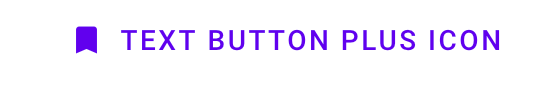
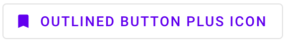

<!--docs:
title: "Buttons"
layout: detail
section: components
excerpt: "Web Buttons"
iconId: button
path: /catalog/buttons/
-->

# Buttons

[Buttons](https://material.io/components/buttons/) は一度タップすることにより、ユーザーにアクションを起こさせ、選択肢を生成します。

ボタンには4つのタイプがあります。

1. [テキストボタン](#text-button)
2. [枠付きボタン](#outlined-button)
3. [囲みボタン](#contained-button)
4. [トグルボタン](#toggle-button)

**注意: トグルボタンは `mdc-icon-button` コンポーネントを使って実装されています。さらなる情報は [`mdc-icon-button` のページ](../mdc-icon-button) を参照してください。


## ボタンを使う

### インストール

```
npm install @material/button
```

### スタイル

```scss
@use "@material/button";

@include button.core-styles;
```

### JavaScript のインスタンス化

ボタンは JavaScript なしでも動作しますが、ルート要素上の `MDCRipple` をインスタンス化することによりリップルエフェクトをつけることができます。詳細は [MDC Ripple](../mdc-ripple) を参照してください。

```js
import {MDCRipple} from '@material/ripple';

const buttonRipple = new MDCRipple(document.querySelector('.mdc-button'));
```

**注意: JavaScript をインポートする方法についてのさらなる情報は [JS コンポーネントのインポート](../../docs/importing-js.md) を参照してください。**

### ボタンを操作しやすくする

マテリアルデザイン仕様ではタッチの対象は少なくとも  48 x 48 px にすることを勧めています。この要件を満たすためにボタンに以下のものを追加してください。

```html
<div class="mdc-touch-target-wrapper">
  <button class="mdc-button mdc-button--touch">
    <div class="mdc-button__ripple"></div>
    <span class="mdc-button__label">My Accessible Button</span>
    <div class="mdc-button__touch"></div>
  </button>
</div>
```
**注意: 隣接している要素において、潜在的に（マージンを縮小するために）タッチ対象が重なってしまうのを避けたい場合は、外側に `mdc-touch-target-wrapper` 要素だけが必要なことに注意してください。**

## <a name="text-button"></a>テキストボタン

[テキストボタン](https://material.io/components/buttons/#text-button) は通常、ダイアログやカード内に配置される宣言的でない操作に使われます。カードではテキストボタンはカードの内容を強調するのに役立ちます。

### テキストボタンの例


```html
 <button class="mdc-button">
   <div class="mdc-button__ripple"></div>
   <span class="mdc-button__label">Text Button</span>
</button>
```

<b>アイコンを伴うテキストボタンの例</b>



```html
<button class="mdc-button">
  <div class="mdc-button__ripple"></div>
  <i class="material-icons mdc-button__icon" aria-hidden="true"
    >bookmark</i
  >
  <span class="mdc-button__label">Text Button plus icon</span>
</button>

```

## <a name="contained-button"></a>枠付きボタン

[枠付きボタン](https://material.io/components/buttons/#outlined-button) は中程度の重要性のあるボタンです。重要なアクションも含まれていますが、アプリケーションの主要なアクションではありません。

### 枠付きボタンの例


```html
<button class="mdc-button--outlined">
  <div class="mdc-button__ripple"></div>
  <span class="mdc-button__label">Outlined Button</span>
</button>
```

<b>アイコンを伴う枠付きボタンの例</b>



```html
<button class="mdc-button mdc-button--outlined">
  <div class="mdc-button__ripple"></div>
  <i class="material-icons mdc-button__icon" aria-hidden="true">bookmark</i>
  <span class="mdc-button__label">Outlined Button plus Icon</span>
</button>
```

## <a name="outlined-button"></a>囲みボタン

[囲みボタン](https://material.io/components/buttons/#contained-button) は非常に重要なもので、浮き上がりと塗りを使うことによって目立せたものです。これにはアプリケーションの主要なアクションが含まれます。

#### 囲みボタンの例


```html
<button class="mdc-button--raised">
  <span class="mdc-button__label">Contained Button</span>
</button>
```

**注意**: `mdc-button--raised` は浮き上がっている囲みボタンに適用し、`mdc-button--unelevated` は表面と同じ高さの囲みボタンに適用します。

<b>アイコンを伴う囲みボタンの例</b>


```html
<button class="mdc-button mdc-button--raised">
  <div class="mdc-button__ripple"></div>
  <i class="material-icons mdc-button__icon" aria-hidden="true"
    >bookmark</i
  >
  <span class="mdc-button__label">Contained Button plus Icon</span>
</button>
```

## <a name="toggle-button"></a>トグルボタン

[トグルボタン](https://material.io/components/buttons/#toggle-button) は選択肢の集まりから選ぶ際に使われます。

トグルボタンには2つのタイプがあります。

* [トグルボタン](#toggle-button)
* [アイコン](#icon)


MDC Web は今のところトグルボタングループをサポートしていません。

### <a name="icon"></a>アイコン

アイコンはアイテムをお気に入りとしてマークするなど、一つの選択肢を選択もしくは選択解除するときにトグルボタンとして使用できます。

さらなる詳細は [`mdc-icon-button` のページ](../mdc-icon-button) を参照してください。

## 他のバリエーション

### アイコン

Google フォントにある [Material Icons](https://material.io/tools/icons/) を使うことを推奨します。

```html
<head>
  <link rel="stylesheet" href="https://fonts.googleapis.com/icon?family=Material+Icons">
</head>
```

また、SVG や [Font Awesome](https://fontawesome.com/) 、そのほかの利用したいアイコンライブラリを使うこともできます。

アイコンを追加するには、`mdc-button__icon` クラスをボタン要素の中に追加し、`aria-hidden="true"` 属性を設定します。アイコンは可視性が必要であるので 18px に設定します。

```html
<button class="mdc-button">
  <div class="mdc-button__ripple"></div>
  <i class="material-icons mdc-button__icon" aria-hidden="true">favorite</i>
  <span class="mdc-button__label">Button</span>
</button>
```

SVG アイコンを使うことも可能です。

```html
<button class="mdc-button">
  <div class="mdc-button__ripple"></div>
  <svg class="mdc-button__icon" aria-hidden="true" xmlns="http://www.w3.org/2000/svg" viewBox="...">
  ...
  </svg>
  <span class="mdc-button__label">Button</span>
</button>
```

#### 後置アイコン

一部のアイコンはボタンのテキストラベルの前にあるよりも後ろにあるほうがより分かりやすくなります。アイコンのマークアップを `mdc-button__label` 要素の <em>後ろ</em> に置くことによって実現できます。

```html
<button class="mdc-button">
  <div class="mdc-button__ripple"></div>
  <span class="mdc-button__label">Button</span>
  <i class="material-icons mdc-button__icon" aria-hidden="true">favorite</i>
</button>
```

> <em>注意</em>: `mdc-button__label` 要素は後置アイコンが適切にスタイルされるためには <em>必須</em> です。

### 無効の状態

ボタンを無効にするには、`<button>` に直接 `disabled` 属性を追加するか、ボタンを含んでいる `<fieldset>` に `disabled` 属性を設定します。無効になったボタンは利用できなくなり、視覚的にも利用できるようなエフェクトがなくなります。

```html
<button class="mdc-button" disabled>
  <div class="mdc-button__ripple"></div>
  <span class="mdc-button__label">Button</span>
</button>
```

## ボタンのテーマのサンプル

マテリアルテーマでのテキストボタン、囲みボタン、枠付きボタンの例は以下の通りです。


### Sass 変数によるテーマ

任意の MDC Web モジュールをインポートする前に、Sass ファイルでテーマカラーを設定します。

```scss
@use "@material/theme" with (
  $primary: #FEDBD0,
  $on-primary: #442C2E
);
```

この場合には、色のコントラスト要件を満足させるために、テキストボタンと枠付きボタンのラベルの色も変更したいです。`custom-text-button` クラスと `custom-outlined-button` クラスをボタンに適用していると仮定します。

```scss
@use "@material/button";

@include button.core-styles;

.custom-text-button,
.custom-outlined-button {
  @include button.ink-color(#84565E);
}
```

### CSS カスタムプロパティを使ったテーマ

アプリケーションを通じたテーマを変更せずにボタンのテーマを変更したいなら、CSS カスタムプロパティを使うこともできます。

```scss
@use "@material/button";

@include button.core-styles;

.custom-text-button,
.custom-outlined-button {
  --mdc-theme-primary: #FEDBD0;
  --mdc-theme-on-primary: #442C2E;

  @include button.ink-color(#84565E);
}
```

テーマに関する一般的でよりさらなる情報は [このページ](../../docs/theming.md) を参照してください。

## API

### CSS クラス

CSS クラス | 説明
--- | ---
`mdc-button` | 必須。デフォルトでは画面の表面と同一平面上にあるテキストボタン。
`mdc-button__ripple` | 必須。リップルスタイルで表示される要素であることを示す。
`mdc-button--raised` | オプション。画面の表面から浮き上がったボタンにする。
`mdc-button--unelevated` | オプション。画面の表面と同一平面上にあるボタンにする。
`mdc-button--outlined` | オプション。画面の表面と同一平面上にあり、枠付きボタンにする。
`mdc-button__label` | 推奨\*。ボタンのテキストラベルを含む要素であることを示す。
`mdc-button__icon` | オプション。ボタンのアイコンを含む要素であることを示す。

**注意: `mdc-button__label` 要素は後置アイコンのあるボタンでは必須ですが、現状ではアイコンのないボタンや前置アイコンのボタンではオプションです。後者の場合、テキストラベルは単に直接 `mdc-button` 要素の中にあってもかまいません。<br>
しかし、`mdc-button__label` クラスは今後すべての場合で必須となるかもしれないので、今後のために常に含めることを推奨します。**

### Sass ミキシン

ボタンの色やスタイルをカスタマイズする目的で以下のミキシンを使うことができます。

#### 基本的な Sass ミキシン

MDC Button はデフォルトで [MDC Theme](../mdc-theme) の `primary` カラーを使います。カスタマイズするには次のミキシンを使います。

ミキシン | 説明
--- | ---
`filled-accessible($container-fill-color)` | 囲まれた (_raised_ or _unelevated_) ボタンでの囲みの色を設定し、ボタンのインク、アイコン、リップルの色をアクセシビリティ標準に適合したものにします。

#### 高度な Sass ミキシン

これらのミキシンはコンテナやインク、境界線、リップルの色を上書きします。ボタンをアクセシビリティ標準に適合させることはあなたの責務になります。

ミキシン | 説明
--- | ---
`container-fill-color($color)` | 有効なボタンにおいて与えた色にコンテナの塗りの色を設定する。
`disabled-container-fill-color($color)` | 無効なボタンにおいて与えた色にコンテナの塗りの色を設定する。
`icon-color($color)` | 有効なボタンにおいて与えられた色にアイコンの色を設定する。
`disabled-icon-color($color)` | 無効なボタンにおいて与えられた色にアイコンの色を設定する。
`ink-color($color)` | 有効なボタンにおいて与えた色にインクの色を設定し、`icon-color` を使わないときはアイコンの色も与えられた色にする。
`disabled-ink-color($color)` |  無効なボタンにおいて与えた色にインクの色を設定し、`icon-color` を使わないときはアイコンの色も与えられた色にする。
`density($density-scale)` | ボタンの密度スケールを設定する。サポートしている密度スケール値は (`-3`, `-2`, `-1`, `0`)。
`height($height)` | ボタンのカスタムの高さを設定する。
`shape-radius($radius, $density-scale, $rtl-reflexive)` | 与えられた半径の大きさの丸い形状にボタンを設定する。`$density-scale` は `$radius` 値がパーセント単位のときのみ必須で、デフォルトは `$density-default-scale`。`$rtl-reflexive` を true にする（デフォルトは false）と RTL コンテキスト において半径の値を反転する。
`horizontal-padding($padding)` | 与えた大きさに水平方向のパディングを設定する。
`outline-color($color)` | 有効なボタンにおいて与えた色に境界の色を設定する。
`disabled-outline-color($color)` | 無効なボタンにおいて与えた色に境界の色を設定する。
`outline-width($width, $padding)` | 与えた大きさ（デフォルトは 2px）に境界線の太さを設定し、適切なパディングに調整する。`$padding` は `$horizontal-padding` に固有の値が設定されている場合に限り必須。
