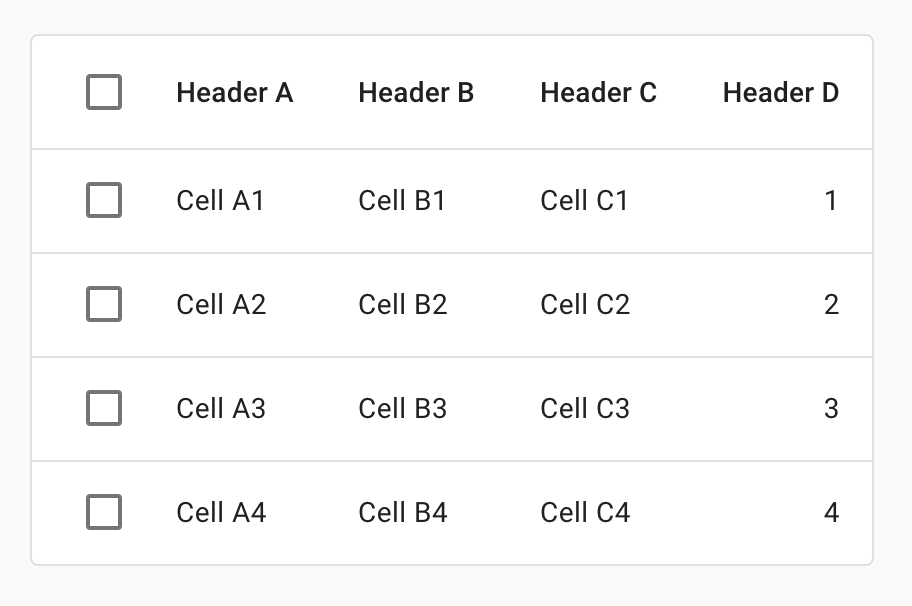

<!--docs:
title: "Data Tables"
layout: detail
section: components
excerpt: "Data tables display information in a grid-like format of rows and columns."
iconId: data_table
path: /catalog/data-tables/
-->

# Data tables

[Data tables](https://material.io/components/data-tables/#) は列と行を通じてデータの集合を表示します。



## データテーブルを使う

データテーブルはグリッド風の行と列の形式で情報を表示します。ユーザーがパターンや洞察を見つけやすいように、スキャンしやすい方法で情報を整理します。

データテーブルには以下のものを含められます。

* 双方向コンポーネント（チップやボタン、メニューなど）
* 双方向でない要素（バッジなど）
* データの問い合わせと操作を行うツール


### インストール

```
npm install @material/data-table
```

### スタイル

```scss
@use "@material/checkbox"; // Required only for data table with row selection.
@use "@material/icon-button"; // Required only for data table with column sorting.
@use "@material/data-table";

@include checkbox.core-styles;
@include icon-button.core-styles;
@include data-table.core-styles;
@include data-table.theme-baseline;
```

**注意: データテーブルに含めるつもりのコンポーネント（例えばチェックボックスやボタン等）のスタイルもロードしなくてはなりません。**

### JavaScript のインスタンス化

```js
import {MDCDataTable} from '@material/data-table';
const dataTable = new MDCDataTable(document.querySelector('.mdc-data-table'));
```

> JavaScript をインポートする方法についてのさらなる情報は [JS コンポーネントのインポート](../../docs/importing-js.md) を参照してください。

> `MDCDataTable` コンポーネントのインスタンス化は双方向の操作、例えば行選択、を追加したいときのみ必要です。

MDC Data Table コンポーネントはヘッダー行のチェックボックスとすべてのチェックボックスの `MDCCheckbox` を自動的にインスタンス化します。チェックボックスコンポーネントをインスタンス化するのに必要なクラス名を設定してください。行を追加したりデータテーブルから行を削除するときには新しいチェックボックスコンポーネントを登録するために `layout` API を使うことをお勧めします。

### データテーブルを操作しやすくする

テーブル要素に必要な ARIA 推奨のロール、状態、プロパティについては [テーブルについての WAI-ARIA オーサリングプラクティス](https://www.w3.org/TR/wai-aria-practices-1.1/#table) を参照してください。

## データテーブル

データテーブルは現在、以下の機能をサポートします。

### 標準のデータテーブル

行選択やソートなどのインタラクティブな要素のないデータテーブルにするには以下のものを使います。

```html
<div class="mdc-data-table">
  <div class="mdc-data-table__table-container">
    <table class="mdc-data-table__table" aria-label="Dessert calories">
      <thead>
        <tr class="mdc-data-table__header-row">
          <th class="mdc-data-table__header-cell" role="columnheader" scope="col">Dessert</th>
          <th class="mdc-data-table__header-cell mdc-data-table__header-cell--numeric" role="columnheader" scope="col">Carbs (g)</th>
          <th class="mdc-data-table__header-cell mdc-data-table__header-cell--numeric" role="columnheader" scope="col">Protein (g)</th>
          <th class="mdc-data-table__header-cell" role="columnheader" scope="col">Comments</th>
        </tr>
      </thead>
      <tbody class="mdc-data-table__content">
        <tr class="mdc-data-table__row">
          <th class="mdc-data-table__cell" scope="row">Frozen yogurt</th>
          <td class="mdc-data-table__cell mdc-data-table__cell--numeric">24</td>
          <td class="mdc-data-table__cell mdc-data-table__cell--numeric">4.0</td>
          <td class="mdc-data-table__cell">Super tasty</td>
        </tr>
        <tr class="mdc-data-table__row">
          <th class="mdc-data-table__cell" scope="row">Ice cream sandwich</th>
          <td class="mdc-data-table__cell mdc-data-table__cell--numeric">37</td>
          <td class="mdc-data-table__cell mdc-data-table__cell--numeric">4.33333333333</td>
          <td class="mdc-data-table__cell">I like ice cream more</td>
        </tr>
        <tr class="mdc-data-table__row">
          <th class="mdc-data-table__cell" scope="row">Eclair</th>
          <td class="mdc-data-table__cell mdc-data-table__cell--numeric">24</td>
          <td class="mdc-data-table__cell mdc-data-table__cell--numeric">6.0</td>
          <td class="mdc-data-table__cell">New filing flavor</td>
        </tr>
      </tbody>
    </table>
  </div>
</div>
```

### 行選択を伴うデータテーブル

行選択の機能はユーザーが行のチェックボックスを通じてテーブルの行を選択できるようにするものです。ユーザーはヘッダー行のチェックボックスを使うことにより、すべての行を選択もしくは非選択にすることができます。それに加え、各行のチェックボックスが手動で選択されたかプログラムで選択されたかによらず、その選択状態に基づいてヘッダー行のチェックボックスは自動的に更新されます。

#### HTML 構造

```html
<div class="mdc-data-table">
  <div class="mdc-data-table__table-container">
    <table class="mdc-data-table__table" aria-label="Dessert calories">
      <thead>
        <tr class="mdc-data-table__header-row">
          <th class="mdc-data-table__header-cell mdc-data-table__header-cell--checkbox" role="columnheader" scope="col">
            <div class="mdc-checkbox mdc-data-table__header-row-checkbox mdc-checkbox--selected">
              <input type="checkbox" class="mdc-checkbox__native-control" aria-label="Toggle all rows"/>
              <div class="mdc-checkbox__background">
                <svg class="mdc-checkbox__checkmark" viewBox="0 0 24 24">
                  <path class="mdc-checkbox__checkmark-path" fill="none" d="M1.73,12.91 8.1,19.28 22.79,4.59" />
                </svg>
                <div class="mdc-checkbox__mixedmark"></div>
              </div>
              <div class="mdc-checkbox__ripple"></div>
            </div>
          </th>
          <th class="mdc-data-table__header-cell" role="columnheader" scope="col">Signal name</th>
          <th class="mdc-data-table__header-cell" role="columnheader" scope="col">Status</th>
          <th class="mdc-data-table__header-cell" role="columnheader" scope="col">Severity</th>
          <th class="mdc-data-table__header-cell" role="columnheader" scope="col">Stage</th>
          <th class="mdc-data-table__header-cell mdc-data-table__header-cell--numeric" role="columnheader" scope="col">Time</th>
          <th class="mdc-data-table__header-cell" role="columnheader" scope="col">Roles</th>
        </tr>
      </thead>
      <tbody class="mdc-data-table__content">
        <tr data-row-id="u0" class="mdc-data-table__row">
          <td class="mdc-data-table__cell mdc-data-table__cell--checkbox">
            <div class="mdc-checkbox mdc-data-table__row-checkbox">
              <input type="checkbox" class="mdc-checkbox__native-control" aria-labelledby="u0"/>
              <div class="mdc-checkbox__background">
                <svg class="mdc-checkbox__checkmark" viewBox="0 0 24 24">
                  <path class="mdc-checkbox__checkmark-path" fill="none" d="M1.73,12.91 8.1,19.28 22.79,4.59" />
                </svg>
                <div class="mdc-checkbox__mixedmark"></div>
              </div>
              <div class="mdc-checkbox__ripple"></div>
            </div>
          </td>
          <th class="mdc-data-table__cell" scope="row" id="u0">Arcus watch slowdown</th>
          <td class="mdc-data-table__cell">Online</td>
          <td class="mdc-data-table__cell">Medium</td>
          <td class="mdc-data-table__cell">Triaged</td>
          <td class="mdc-data-table__cell mdc-data-table__cell--numeric">0:33</td>
          <td class="mdc-data-table__cell">Allison Brie</td>
        </tr>
        <tr data-row-id="u1" class="mdc-data-table__row mdc-data-table__row--selected" aria-selected="true">
          <td class="mdc-data-table__cell mdc-data-table__cell--checkbox">
            <div class="mdc-checkbox mdc-data-table__row-checkbox mdc-checkbox--selected">
              <input type="checkbox" class="mdc-checkbox__native-control" checked aria-labelledby="u1"/>
              <div class="mdc-checkbox__background">
                <svg class="mdc-checkbox__checkmark" viewBox="0 0 24 24">
                  <path class="mdc-checkbox__checkmark-path" fill="none" d="M1.73,12.91 8.1,19.28 22.79,4.59" />
                </svg>
                <div class="mdc-checkbox__mixedmark"></div>
              </div>
              <div class="mdc-checkbox__ripple"></div>
            </div>
          </td>
          <th class="mdc-data-table__cell" scope="row" id="u1">monarch: prod shared ares-managed-features-provider-heavy</th>
          <td class="mdc-data-table__cell">Offline</td>
          <td class="mdc-data-table__cell">Huge</td>
          <td class="mdc-data-table__cell">Triaged</td>
          <td class="mdc-data-table__cell mdc-data-table__cell--numeric">0:33</td>
          <td class="mdc-data-table__cell">Brie Larson</td>
        </tr>
        <tr data-row-id="u2" class="mdc-data-table__row mdc-data-table__row--selected" aria-selected="true">
          <td class="mdc-data-table__cell mdc-data-table__cell--checkbox">
            <div class="mdc-checkbox mdc-data-table__row-checkbox mdc-checkbox--selected">
              <input type="checkbox" class="mdc-checkbox__native-control" checked aria-labelledby="u2"/>
              <div class="mdc-checkbox__background">
                <svg class="mdc-checkbox__checkmark" viewBox="0 0 24 24">
                  <path class="mdc-checkbox__checkmark-path" fill="none" d="M1.73,12.91 8.1,19.28 22.79,4.59" />
                </svg>
                <div class="mdc-checkbox__mixedmark"></div>
              </div>
              <div class="mdc-checkbox__ripple"></div>
            </div>
          </td>
          <th class="mdc-data-table__cell" scope="row" id="u2">monarch: prod shared ares-managed-features-provider-heavy</th>
          <td class="mdc-data-table__cell">Online</td>
          <td class="mdc-data-table__cell">Minor</td>
          <td class="mdc-data-table__cell">Not triaged</td>
          <td class="mdc-data-table__cell mdc-data-table__cell--numeric">0:33</td>
          <td class="mdc-data-table__cell">Jeremy Lake</td>
        </tr>
        <tr data-row-id="u3" class="mdc-data-table__row">
          <td class="mdc-data-table__cell mdc-data-table__cell--checkbox">
            <div class="mdc-checkbox mdc-data-table__row-checkbox">
              <input type="checkbox" class="mdc-checkbox__native-control" aria-labelledby="u3"/>
              <div class="mdc-checkbox__background">
                <svg class="mdc-checkbox__checkmark" viewBox="0 0 24 24">
                  <path class="mdc-checkbox__checkmark-path" fill="none" d="M1.73,12.91 8.1,19.28 22.79,4.59" />
                </svg>
                <div class="mdc-checkbox__mixedmark"></div>
              </div>
              <div class="mdc-checkbox__ripple"></div>
            </div>
          </td>
          <th class="mdc-data-table__cell" scope="row" id="u3">Arcus watch slowdown</th>
          <td class="mdc-data-table__cell">Online</td>
          <td class="mdc-data-table__cell">Negligible</td>
          <td class="mdc-data-table__cell">Triaged</td>
          <td class="mdc-data-table__cell mdc-data-table__cell--numeric">0:33</td>
          <td class="mdc-data-table__cell">Angelina Cheng</td>
        </tr>
      </tbody>
    </table>
  </div>
</div>
```

#### JavaScript API

- データテーブルに新たな行チェックボックスが追加もしくは削除されたときには `layout()` を使用する。
- プログラムから行の選択状態を取得/設定するには以下の API を使用する。
  - `getSelectedRowIds()`
  - `setSelectedRowIds(string[])`

#### イベント

行選択の機能からは以下のイベントが生成されます。

イベント定数 | イベント名 | detail | 詳細
-- | -- | -- | --
`ROW_SELECTION_CHANGED` | `MDCDataTable:rowSelectionChanged` | `MDCDataTableRowSelectionChangedEventDetail` | 行のチェックボックスが選択もしくは選択解除されたときに発生する。
`SELECTED_ALL` | `MDCDataTable:selectedAll` | `void` | ヘッダー行のチェックボックスが選択されたときに発生する。
`UNSELECTED_ALL` | `MDCDataTable:unselectedAll` | `void` | ヘッダー行のチェックボックスが非選択になったときに発生する。

### ソート可能な列を含むデータテーブル

ソート列の機能はユーザーが列の値に基づき昇順もしくは降順に並べ替えられるようにします。

データテーブルでは以下のようにソートを制御します。

- ソートアイコンがクリックされたときにイベントが起動する。
- ソートの方向に基づきソートアイコンを反転する。
- ソート状態に基づき適切な ARIA 属性を設定する。


データテーブルの利用者は `events.SORTED` イベントで table body（行）をソート順に再描画する必要があります。

#### HTML 構造

ソートに必要な列を一意に識別するためにソート可能なヘッダのセル要素に `data-column-id` を設定してください。

```html
<div class="mdc-data-table">
  <table class="mdc-data-table__table" aria-label="Dessert calories">
    <thead>
      <tr class="mdc-data-table__header-row">
        <th
          class="mdc-data-table__header-cell mdc-data-table__header-cell--with-sort"
          role="columnheader"
          scope="col"
          aria-sort="none"
          data-column-id="dessert"
        >
          <div class="mdc-data-table__header-cell-wrapper">
            <div class="mdc-data-table__header-cell-label">
              Dessert
            </div>
            <button class="mdc-icon-button material-icons mdc-data-table__sort-icon-button">arrow_upward</button>
          </div>
        </th>
        <th
          class="mdc-data-table__header-cell mdc-data-table__header-cell--numeric mdc-data-table__header-cell--with-sort mdc-data-table__header-cell--sorted"
          role="columnheader"
          scope="col"
          aria-sort="ascending"
          data-column-id="carbs"
        >
          <div class="mdc-data-table__header-cell-wrapper">
            <button class="mdc-icon-button material-icons mdc-data-table__sort-icon-button">arrow_upward</button>
            <div class="mdc-data-table__header-cell-label">
              Carbs (g)
            </div>
          </div>
        </th>
        <th
          class="mdc-data-table__header-cell mdc-data-table__header-cell--numeric mdc-data-table__header-cell--with-sort"
          role="columnheader"
          scope="col"
          aria-sort="none"
          data-column-id="protein"
        >
          <div class="mdc-data-table__header-cell-wrapper">
            <button class="mdc-icon-button material-icons mdc-data-table__sort-icon-button">arrow_upward</button>
            <div class="mdc-data-table__header-cell-label">
              Protein (g)
            </div>
          </div>
        </th>
        <th
          class="mdc-data-table__header-cell"
          role="columnheader"
          scope="col"
          data-column-id="comments"
        >
          Comments
        </th>
      </tr>
    </thead>
    <tbody class="mdc-data-table__content">
      <tr class="mdc-data-table__row">
        <td class="mdc-data-table__cell">Frozen yogurt</td>
        <td class="mdc-data-table__cell mdc-data-table__cell--numeric">
          24
        </td>
        <td class="mdc-data-table__cell mdc-data-table__cell--numeric">
          4.0
        </td>
        <td class="mdc-data-table__cell">Super tasty</td>
      </tr>
    </tbody>
  </table>
</div>
```

#### イベント

イベント定数 | イベント名 | detail | 説明
-- | -- | -- | --
`SORTED` | `MDCDataTable:sorted` | `SortActionEventDetail` | ソート可能なヘッダセルがクリックされたときに発生する。

## スタイルのカスタマイズ

### CSS クラス

CSS クラス | 説明
--- | ---
`mdc-data-table` | 必須。`table` とその他の補助的な要素を含んだルート DOM 要素。
`mdc-data-table__table-container` | 必須。テーブル要素のコンテナ。テーブルコンテンツが水平方向にはみ出したときに使われる。
`mdc-data-table__table` | 必須。テーブル要素。`table` HTML タグに追加する。
`mdc-data-table__header-row` | 必須。テーブルヘッダー行要素。`thead > tr` HTML タグに追加する。
`mdc-data-table__header-cell` | 必須。テーブルヘッダーセル要素。`thead > tr > th` HTML タグに追加する。
`mdc-data-table__header-cell--checkbox` | オプション。`mdc-checkbox` を含むテーブルヘッダーセル要素。`thead> tr > th` HTML タグに追加する。
`mdc-data-table__header-cell--numeric` | オプション。数値セルに対応するテーブルヘッダーセル要素。`thead > tr > th` HTML タグに追加する。
`mdc-data-table__content` | 必須。テーブルボディ要素。`tbody` HTML タグに追加する。
`mdc-data-table__row` | 必須。テーブル行要素。`tbody > tr` HTML タグに追加する。
`mdc-data-table__cell` | 必須。テーブルセル要素。`tbody > tr > td` HTML タグに追加する。
`mdc-data-table__cell--numeric` | オプション。数値データを含むテーブルセル要素。`tbody > tr > td` HTML タグに追加する。
`mdc-data-table__cell--checkbox` | オプション。`mdc-checkbox` を含むテーブルセル要素。`tbody > th > td:first-child` HTML タグに追加する。（訳注: 原文は `thead> th > td:first-child` となっているが、`tbody > th > td:first-child` の誤り）
`mdc-data-table__header-row-checkbox` | オプション。テーブルヘッダー行要素に描画されるチェックボックス要素。データテーブルに必須なスタイルに上書きするためにこのクラス名を `mdc-checkbox` 要素に追加する。
`mdc-data-table__row-checkbox` | オプション。テーブル行要素に描画されるチェックボックス要素。データテーブルに必須なスタイルに上書きするためにこのクラス名を `mdc-checkbox` 要素に追加する。
`mdc-data-table__row--selected` | オプション。テーブル行が選択されたときに `mdc-data-table__row` に追加する修飾クラス。
`mdc-data-table__header-cell--sorted` | オプション。列でソートが可能なときにヘッダーセル要素に追加する修飾クラス。
`mdc-data-table__header-cell--sorted-descending` | オプション。列が降順にソートされているときにヘッダーセル要素に追加する修飾クラス。
`mdc-data-table__header-cell--with-sort` | オプション。列がソートをサポートしているときにヘッダーセル要素に追加する修飾クラス。
`mdc-data-table__header-cell-wrapper` | オプション。ヘッダーセルのラベルとソートボタンのコンテナ。ヘッダーセルを中央に配置するために使用する。
`mdc-data-table__sort-icon-button` | オプション。ソートアイコンボタンとして使用するアイコンボタンに追加するクラス名。ヘッダーセルラベルの兄弟要素に付加する。
`mdc-data-table__header-cell-label` | 必須。ヘッダーセルラベルに追加するクラス名。ヘッダーセルラッパー要素の子要素に付加する。

### Sass ミキシン

データテーブルテーマ API の最新のコードドキュメントは [_mixins.scss](./_mixins.scss) ファイルを参照してください。

## `MDCDataTable` プロパティとメソッド

データテーブルコンポーネント API の最新のコードドキュメントは [component.ts](./component.ts) ファイルを参照してください。

## Web フレームワークでの使用

React や Angular のような JavaScript フレームワークを使っているなら、そのフレームワーク用のデータテーブルを作ることができます。ニーズに合わせて、<em>単純な手法: MDC Web の素のコンポーネントをラップする</em> や <em>高度な方法: ファンデーションアダプターを使用する</em> を使うことができます。[ここ](../../docs/integrating-into-frameworks.md) にある説明にしたがってください。

データテーブルファンデーション API の最新のコードドキュメントは [MDCDataTableAdapter](./adapter.ts) と [MDCDataTableFoundation](./foundation.ts) 参照してください。
