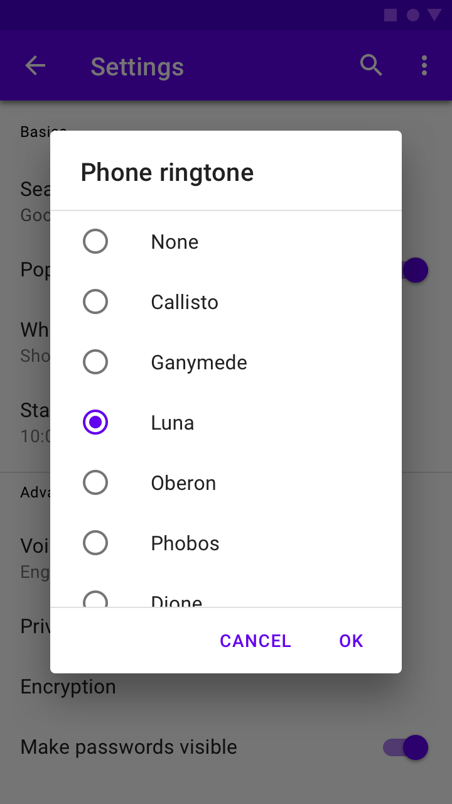

<!--docs:
title: "Dialogs"
layout: detail
section: components
excerpt: "Modal dialogs."
iconId: dialog
path: /catalog/dialogs/
-->

# Dialogs

ダイアログはユーザーにタスクに関する通知をし、重要な情報を含めたり、決定を求めたり、複数のタスクに関わらせることができます。

ダイアログには4つのタイプ場あります。

1. [警告](#alert-dialog)
1. [シンプル](#simple-dialog)
1. [確認](#confirmation-dialog)
1. [全画面](#full-screen-dialog)

## ダイアログを使う

ダイアログは重要な情報の提供や決定を求めるためにアプリケーションコンテンツの前面に表示される一種のモーダルウィンドウです。ダイアログは表示される際にすべてのアプリケーションの機能を使用できないようにし、確認、却下もしくは必要な操作がなされるまで画面に残ります。

ダイアログは意図的にアプリケーションを中断するため、使用は控えるべきです。

追加のガイダンスは、[マテリアルガイドライン](https://material.io/go/design-dialogs) を参照してください。

### インストール

```
npm install @material/dialog
```

### スタイル

```scss
@use "@material/dialog";

@include dialog.core-styles;
```

**注意: ダイアログに含め用と思っている任意のコンポーネント（例: リスト、チェックボックス等）のスタイルもインポートしなくてはなりません。**

### JavaScript のインスタンス化

```js
import {MDCDialog} from '@material/dialog';
const dialog = new MDCDialog(document.querySelector('.mdc-dialog'));
```

**注意: JavaScript をインポートする方法についてのさらなる情報は [JS コンポーネントのインポート](../../docs/importing-js.md) を参照してください。**

MDC Dialog は `mdc-dialog__content` 要素に追加されるものについての仮定はありません。任意のリストやチェックボックスなどがインスタンス化されなくてはなりません。ダイアログがレイアウトに依存するコンポーネントを含んでいるときは、ダイアログの移動をまず完了させるために `MDCDialog:opened` が発行されるまでコンポーネントのインスタンス化（これらの `layout` の呼び出し）を待たなくてはなりません。

例えば、簡易ダイアログもしくは確認ダイアログの MDC List をインスタンス化するには次のようにします。

```js
import {MDCList} from '@material/list';
const list = new MDCList(document.querySelector('.mdc-dialog .mdc-list'));

dialog.listen('MDCDialog:opened', () => {
  list.layout();
});
```

**注意: 要素の配置の誤りやサイズの間違い（例えばリップルやフローティングラベル、ノッチ付きアウトライン）はダイアログの表示が完了する前に子コンポーネントがインスタンス化されていることを示唆しています。**

### ダイアログを操作しやすくする

#### `aria-modal` の代替として `aria-hidden` を使う

`aria-modal` は ARIA 1.1 仕様の一部であり、スクリーンリーダーに対して単一の要素にとどめること表しています（訳注: スクリーンリーダーは `aria-modal` で指定された領域しか読み上げの対象にしない、ということ）。その DOM 構造のルート要素に `aria-modal="true"` を付加することを推奨します。

しかしながら、すべてのユーザーエージェントとスクリーンリーダーがこの属性を正しく解釈するわけではありません。

代わりとして、ダイアログが開いているときは、ダイアログの下にある静的コンテンツすべてに `aria-hidden` を `aria-hidden="true"` として使います。これは、非モーダル要素が body の下の一つの共通の祖先であるときに最も容易に実現でき、その一つの要素に `aria-hidden` を適用すればよいのです。

```js
dialog.listen('MDCDialog:opened', function() {
  // contentElement がページのほかのコンテンツの共通の親要素を参照していると仮定
  contentElement.setAttribute('aria-hidden', 'true');
});
dialog.listen('MDCDialog:closing', function() {
  contentElement.removeAttribute('aria-hidden');
});
```

**注意: 上の例では、ほかの要素が表示される前にある要素が非表示になることによってスクリーンリーダーが要素間を飛び回ることを避けるために、意図的に opened（opening ではなく）イベントと closing（closed ではなく）イベントで処理しています。**

## <a name="alert-dialog"></a>警告ダイアログ

警告ダイアログは緊急の情報、詳細、または操作により、ユーザーを中断させます。


### 警告ダイアログの例

```html
<div class="mdc-dialog">
  <div class="mdc-dialog__container">
    <div class="mdc-dialog__surface"
      role="alertdialog"
      aria-modal="true"
      aria-labelledby="my-dialog-title"
      aria-describedby="my-dialog-content">
      <div class="mdc-dialog__content" id="my-dialog-content">
        Discard draft?
      </div>
      <div class="mdc-dialog__actions">
        <button type="button" class="mdc-button mdc-dialog__button" data-mdc-dialog-action="cancel">
          <div class="mdc-button__ripple"></div>
          <span class="mdc-button__label">Cancel</span>
        </button>
        <button type="button" class="mdc-button mdc-dialog__button" data-mdc-dialog-action="discard">
          <div class="mdc-button__ripple"></div>
          <span class="mdc-button__label">Discard</span>
        </button>
      </div>
    </div>
  </div>
  <div class="mdc-dialog__scrim"></div>
</div>
```

## <a name="simple-dialog"></a>シンプルダイアログ

シンプルダイアログは選ぶとすぐに反応する項目を表示します。これらはテキストボタンはありません。

シンプルダイアログは中断を招くので、使用は控えるべきです。代わりとして、ドロップダウンメニューはモーダルではなく、中断の少ない方法で選択肢を適用できます。


### シンプルダイアログの例

```html
<div class="mdc-dialog">
  <div class="mdc-dialog__container">
    <div class="mdc-dialog__surface"
      role="alertdialog"
      aria-modal="true"
      aria-labelledby="my-dialog-title"
      aria-describedby="my-dialog-content">
      <!-- mdc-typography-baseline-top() の動作により、タイトルの先頭に空白を入れることはできない -->
      <h2 class="mdc-dialog__title" id="my-dialog-title"><!--
     -->Choose a Ringtone<!--
   --></h2>
      <div class="mdc-dialog__content" id="my-dialog-content">
        <ul class="mdc-list mdc-list--avatar-list">
          <li class="mdc-list-item" tabindex="0" data-mdc-dialog-action="none">
            <span class="mdc-list-item__text">None</span>
          </li>
          <li class="mdc-list-item" data-mdc-dialog-action="callisto">
            <span class="mdc-list-item__text">Callisto</span>
          </li>
          <!-- ... -->
        </ul>
      </div>
    </div>
  </div>
  <div class="mdc-dialog__scrim"></div>
</div>
```

**注意: `mdc-list--avatar-list` クラスが含まれていることに注意してください。これはシンプルダイアログ仕様に沿ったものです。**

## <a name="confirmation-dialog"></a>確認ダイアログ

確認ダイアログは確定前にユーザーが最終的な確認を行えるようにするため、必要に応じて選択の変更の機会を与えます。

ユーザーが選択を確認すると、それが実行されます。そうでないとき、ユーザーはダイアログを閉じることができます。例えば、ユーザーは複数の着信音を聞くことができますが、「OK」をタックした時にのみ、最終的な選択がなされます。



### 確認ダイアログの例

```html
<div class="mdc-dialog">
  <div class="mdc-dialog__container">
    <div class="mdc-dialog__surface"
      role="alertdialog"
      aria-modal="true"
      aria-labelledby="my-dialog-title"
      aria-describedby="my-dialog-content">
      <!-- mdc-typography-baseline-top() の動作により、タイトルの先頭に空白を入れることはできない -->
      <h2 class="mdc-dialog__title" id="my-dialog-title"><!--
     -->Choose a Ringtone<!--
   --></h2>
      <div class="mdc-dialog__content" id="my-dialog-content">
        <ul class="mdc-list">
          <li class="mdc-list-item" tabindex="0">
            <span class="mdc-list-item__graphic">
              <div class="mdc-radio">
                <input class="mdc-radio__native-control"
                       type="radio"
                       id="test-dialog-baseline-confirmation-radio-1"
                       name="test-dialog-baseline-confirmation-radio-group"
                       checked>
                <div class="mdc-radio__background">
                  <div class="mdc-radio__outer-circle"></div>
                  <div class="mdc-radio__inner-circle"></div>
                </div>
              </div>
            </span>
            <label id="test-dialog-baseline-confirmation-radio-1-label"
                   for="test-dialog-baseline-confirmation-radio-1"
                   class="mdc-list-item__text">None</label>
          </li>
          <!-- ... -->
        </ul>
      </div>
      <div class="mdc-dialog__actions">
        <button type="button" class="mdc-button mdc-dialog__button" data-mdc-dialog-action="close">
          <div class="mdc-button__ripple"></div>
          <span class="mdc-button__label">Cancel</span>
        </button>
        <button type="button" class="mdc-button mdc-dialog__button" data-mdc-dialog-action="accept">
          <div class="mdc-button__ripple"></div>
          <span class="mdc-button__label">OK</span>
        </button>
      </div>
    </div>
  </div>
  <div class="mdc-dialog__scrim"></div>
</div>
```

**注意: 上の例では、スクリム（訳注: ダイアログの背後に表示される半透明の背景のこと）をクリックしたときやエスケープキーを押されたときの動作と連携する `close` アクションをキャンセルボタンに意図的に持たせています。キャンセルボタンでは検出された動作によらず、同じ方法で対話を処理することを許容しています。**

## <a name="full-screen-dialog"></a>全画面ダイアログ

全画面ダイアログは、イベントタイトル、日付、場所や時間をカレンダーに入力するといった一連のタスクをグループ化します。スクリーンを占有するため、全画面ダイアログは他のダイアログの上にかぶせられる唯一のダイアログです。

MDC Web はまだ全画面ダイアログをサポートしていません。


## 追加情報

### ダイアログアクション

すべてのダイアログのバリエーションはダイアログアクションの概念をサポートしています。ダイアログ内の任意の要素に `data-mdc-dialog-action` 属性を含めることができ、それと対話することにより指定したアクションでダイアログが閉じるべきであることを表しています。このアクションは `MDCDialog:closing` イベントと `MDCDialog:closed` イベント内で `event.detail.action` を通じて反映されます。

加えて、二つの操作がアクションとして最初から定義されています。

* スクリム上をクリック
* ダイアログ内でのエスケープキーの押下

これら両方ともデフォルトで `close` アクションに対応しています。これはそれぞれコンポーネントの `scrimClickAction` プロパティと `escapeKeyAction` プロパティを通じてアクセスや変更が可能になっています。

これらのプロパティにからの文字列を設定すれば操作は無効になります（つまり、ダイアログがその操作によって閉じなくなります）。これを行うときは注意が必要です - ユーザーはいつでもダイアログを閉じることができるようにするべきです。

ダイアログ内にあるさらなる動作を伴わずに閉じるアクションと厳密に同じ動きをするすべてのアクションボタンも `close` アクションを使うべきです。これによって、個別にハンドリングされているほかのアクションと共にすべてのアクションを一貫して処理することが容易になります。

### アクションボタンの配置

[Dialog design article](https://material.io/design/components/dialogs.html#anatomy) に示されている通り、`mdc-dialog__actions` 要素内のボタンはデフォルトで水平方向に配置され、確認アクションが <em>最後に</em> 配置されます。

すべてのボタンを1行に収めるのにボタンの文字が長すぎるときには、ボタンを垂直方向に重ね、確認アクションを <em>最初に</em> 配置します。

MDC Dialog はデフォルトでこれを自動で検知して処理し、重ねるレイアウトにするときはボタンを逆順にします。この自動的な動作はコンポーネントのインスタンスの `autoStackButtons` を `false` にすることにより無効にすることができます。

```js
dialog.autoStackButtons = false;
```

コンポーネントがインスタンス化される前に手動でルート要素に `mdc-dialog--stacked` 修飾クラスが適用されているときにもこれは無効になりますが、ダイアログアクションボタンのラベルは1行に収まるように可能な限り短くすることをお勧めします。

### デフォルトアクションボタン

ダイアログのアクションボタンの一つがデフォルトアクションを表し、エンターキーを押したことがトリガーになることを MDC Dialog はサポートしています。これは例えば単一選択確認ダイアログに使用することができ、選択肢を確認するために適切なボタンに移動するまでダブボタンを押さずに選択を素早く行えるようになります。

デフォルトアクションボタンであることを示すには、`data-mdc-dialog-button-default` データ属性を追加します。例えば次のようにします。
```html
...
<div class="mdc-dialog__actions">
  <button type="button" class="mdc-button mdc-dialog__button" data-mdc-dialog-action="close">
    <div class="mdc-button__ripple"></div>
    <span class="mdc-button__label">Cancel</span>
  </button>
  <button type="button" class="mdc-button mdc-dialog__button" data-mdc-dialog-action="accept" data-mdc-dialog-button-default>
    <div class="mdc-button__ripple"></div>
    <span class="mdc-button__label">OK</span>
  </button>
</div>
...
```

### アクションと選択

選択コントロールを通じて選択することが必要なダイアログは、デフォルトで選択肢が選択されていないのであれば最初はアクションを実行するボタンを無効にする必要があります。MDC Dialog はこのロジックをビルドインで含んでいません。これは取られたアクションに関する情報を中継することは別として、可能な限りダイアログの中身に依存しないでいることを目指しているためです。

## スタイルのカスタマイズ

### CSS クラス

CSS クラス | 説明
--- | ---
`mdc-dialog` | 必須。表示面とコンテナを含んでいるルート DOM 要素。
`mdc-dialog__scrim` | 必須。ダイアログの背後に表示される半透明の背景。
`mdc-dialog__container` | 必須。IE 11 でフレックスボックスの動作を保証するために必要なラッパー要素。
`mdc-dialog__surface` | 必須。ダイアログのコンテンツのためにくくられた領域。
`mdc-dialog__title` | オプション。ダイアログの目的の簡潔な概要。
`mdc-dialog__content` | オプション。主たるコンテンツ領域。リストまたはフォーム、文章を含めることができる。
`mdc-dialog__actions` | オプション。ダイアログのアクションボタンを含むフッター領域。
`mdc-dialog__button` | オプション。個々のアクションボタン。通常は [`mdc-button`](../mdc-button) とペアで使う。
`mdc-dialog--open` | オプション。ダイアログが開いおり表示されていることを示す。
`mdc-dialog--opening` | オプション。ダイアログが開くアニメーションの過程で自動的に適用される。
`mdc-dialog--closing` | オプション。ダイアログが閉じるアニメーションの過程で自動的に適用される。
`mdc-dialog--scrollable` | オプション。ダイアログのコンテンツがオーバーフローしていてスクロールが必要な際に自動的に適用される。
`mdc-dialog--stacked` | オプション。ダイアログのアクションボタンが1行に収まらず、重ねなくてはならないときに自動的に適用される。

### Sass ミキシン

ミキシン | 説明
--- | ---
`container-fill-color($color)` | ダイアログの塗りの色を設定する。
`scrim-color($color, $opacity)` | ダイアログ背景のスクリムの色を設定する。
`title-ink-color($color, $opacity)` | ダイアログのタイトルテキストの色を設定する。
`content-ink-color($color, $opacity)` | ダイアログのコンテンツテキストの色を設定する。
`content-padding($padding-top, $padding-right, $padding-bottom, $padding-left)` | ダイアログのコンテンツのパディングを設定する。
`scroll-divider-color($color, $opacity)` | スクロールするコンテンツの周囲に表示される境界の色を設定する。
`shape-radius($radius, $rtl-reflexive)` | ダイアログ面の角を与えられた半径の大きさに丸める。RTL コンテンツにおいて半径の値を反転するには `$rtl-reflexive` を true に設定する。デフォルトは false。
`min-width($min-width)` | ダイアログの最小幅を設定する（デフォルトは 280px）。
`max-width($max-width, $margin)` | ダイアログの最大幅を設定する（デフォルトは最大幅 280px、マージン 16px）。
`max-height($max-height, $margin)` | ダイアログの最大の高さを設定する（デフォルトは最大の高さ制限なし、マージン 16px）。

**注意: `max-width` ミキシンと `max-height` ミキシンは幅、高さのそれぞれがマージンを考慮したうえでビューポートが指定された値を収めるのに十分な大きさがあるときに適用されます。ビューポートが小さいときには、ダイアログはマージンが端の周囲に保たれるような大きさになります。**

## その他のカスタマイズ
データ属性 | 説明
--- | ---
`data-mdc-dialog-button-default` | オプション。ボタンがデフォルトアクションボタン（上記デフォルトアクションボタンを参照）であることを示す。
`data-mdc-dialog-initial-focus` | オプション。要素がダイアログが開いた後に初期フォーカスを持っていることを示す。

## `MDCDialog` プロパティとメソッド

プロパティ | 値の型 | 説明
--- | --- | ---
`isOpen` | `boolean` (読取専用) | ファンデーションの `isOpen` メソッドの代替。
`escapeKeyAction` | `string` | ファンデーションの `getEscapeKeyAction` メソッドと `setEscapeKeyAction` メソッドの代替。
`scrimClickAction` | `string` | ファンデーションの `getScrimClickAction` メソッドと `setScrimClickAction` メソッドの代替。
`autoStackButtons` | `boolean` | ファンデーションの `getAutoStackButtons` メソッドと `setAutoStackButtons` メソッドの代替。

メソッド | 説明
--- | ---
`layout() => void` | レイアウトを再計算して自動的に `--scrollable` といった修飾クラスを追加/削除する。
`open() => void` | ダイアログを開く。
`close(action: string?) => void` | ダイアログを閉じる。オプションで閉じられた理由を示す指定されたアクションを伴う。

### イベント

イベント | `event.detail` | 説明
--- | --- | ---
`MDCDialog:opening` | `{}` | ダイアログが開くアニメーションの開始時点を表す。
`MDCDialog:opened` | `{}` | ダイアログが開くアニメーションの終了時点を表す。
`MDCDialog:closing` | `{action: string?}` | ダイアログが閉じるアニメーションの開始時点を表す。`action` はダイアログを閉じたアクションを示す。
`MDCDialog:closed` | `{action: string?}` | ダイアログが閉じるアニメーションの終了時点を表す。`action` はダイアログを閉じたアクションを示す。

## Web フレームワークでの使用

React や Angular のような JavaScript フレームワークを使っているなら、そのフレームワーク用のダイアログを作ることができます。ニーズに合わせて、<em>単純な手法: MDC Web の素のコンポーネントをラップする</em> や <em>高度な方法: ファンデーションアダプターを使用する</em> を使うことができます。[ここ](../../docs/integrating-into-frameworks.md) にある説明にしたがってください。

### `MDCDialogAdapter`

メソッド | 説明
--- | ---
`addClass(className: string) => void` | ルート要素にクラスを追加する。
`removeClass(className: string) => void` | ルート要素からクラスを削除する。
`hasClass(className: string) => boolean` | ルート要素が与えられた CSS クラスがあるかどうかを返す。
`addBodyClass(className: string) => void` | `<body>` にクラスを追加する。
`removeBodyClass(className: string) => void` | `<body>` からクラスを削除する。
`eventTargetMatches(target: EventTarget \| null, selector: string) => void` | 与えられた CSS セレクターがターゲットの要素に符合していたら `true` を返し、そうでないなら `false` を返す。
`trapFocus(initialFocusEl: HTMLElement \| null) => void` | キーボード操作がダイアログ内のフォーカス可能な要素に制限されるように DOM を設定する（詳細は以下の [フォーカストラッピング処理](#handling-focus-trapping) 参照）。設定されていればフォーカスが `initialFocusEl` に移る。
`releaseFocus() => void` | ダイアログのフォーカスとラッピング効果を削除する（詳細は以下の [フォーカストラッピング処理](#handling-focus-trapping) 参照）。
`getInitialFocusEl() => HTMLElement \| null` | ダイアログが開いた後にフォーカスを与えるために `data-mdc-dialog-initial-focus` 要素を返す。
`isContentScrollable() => boolean` | `mdc-dialog__content` がユーザーによってスクロール可能であれば `true` を返し、そうでないなら `false` を返す。
`areButtonsStacked() => boolean` | `mdc-dialog__action` ボタン（`mdc-dialog__button`）が鉛直方向に重ねられていれば `true` を返し、そうでなく並べられていれば `false` を返す。
`getActionFromEvent(event: Event) => string \| null` | 与えられたイベントターゲット、もしくはターゲットの祖先から `data-mdc-dialog-action` 属性の値を取得する。
`clickDefaultButton() => void` | ダイアログ内に `data-mdc-dialog-button-default` 要素があれば、その `click()` を呼び出す。
`reverseButtons() => void` | `mdc-dialog__actions` 要素内のアクションボタンの順番を逆順にする。スタックとアンスタックのボタン配置を切り替える際に使う。
`notifyOpening() => void` | ダイアログがちょうど開き始めることを示すイベントを発生させる。
`notifyOpened() => void` | ダイアログが開き終わることを示すイベントを発生させる。 
`notifyClosing(action: string) {}` | ダイアログがちょうど閉じ始めることを示すイベントを発生させる。空でない `action` が渡されると、イベントの `detail` オブジェクトは `action` プロパティにその値が設定される。
`notifyClosed(action: string) {}` | ダイアログが閉じ終わることを示すイベントを発生させる。空でない `action` が渡されると、イベントの `detail` オブジェクトは `action` プロパティにその値が設定される。

### `MDCDialogFoundation`

メソッド | 説明
--- | ---
`open()` | ダイアログを開く。
`close(action: string)` | ダイアログを閉じる。オプションで閉じられた理由を示す指定されたアクションを伴う。
`isOpen() => boolean` | ダイアログが開いているかどうかを返す。
`layout()` | レイアウトを再計算して自動的に `--scrollable` といった修飾クラスを追加/削除する。
`getEscapeKeyAction() => string` | エスケープキーが押されたときに使われるアクションを返す。
`setEscapeKeyAction(action: string)` | エスケープキーが押されたときに使われるアクションを設定する。`''` を設定するとエスケープキーによってダイアログが閉じなくなる。
`getScrimClickAction() => string` | スクリムがクリックされたときに使われるアクションを返す。
`setScrimClickAction(action: string)` | スクリムがクリックされたときに使われるアクションを設定する。`''` を設定するとスクリムのクリックによってダイアログが閉じなくなる。
`getAutoStackButtons() => boolean` | レイアウト処理によってアクションボタンが重なる/重ならないレイアウトに自動的にするかどうかを返す。
`setAutoStackButtons(autoStack: boolean) => void` | レイアウト処理によってアクションボタンが重なる/重ならないレイアウトに自動的にするかどうかを設定する。
`handleClick(event: MouseEvent)` | ダイアログのルート要素上、もしくは要素内の `click` イベントをハンドリングする。
`handleKeydown(event: KeyboardEvent)` | ダイアログのルート要素上、もしくは要素内の `keydown` イベントをハンドリングする。
`handleDocumentKeydown(event: Event)` | ダイアログが開いている間、ドキュメント上、もしくはドキュメント内の `keydown` イベントをハンドリングする。

#### イベントハンドラー

ダイアログのファンデーションをラップする際には、以下のイベントを対応するファンデーションメソッドにバインドしなくてはいけません。

イベント | ターゲット | ファンデーションハンドラー | 登録 | 登録解除
--- | --- | --- | --- | ---
`click` | `.mdc-dialog` (ルート) | `handleClick` | 初期化の際に | 破棄する際に
`keydown` | `.mdc-dialog` (ルート) | `handleKeydown` | 初期化の際に | 破棄する際に
`keydown` | `document` | `handleDocumentKeydown` | `MDCDialog:opening` 上で | `MDCDialog:closing` 上で
`resize` | `window` | `layout` | `MDCDialog:opening` 上で | `MDCDialog:closing` 上で
`orientationchange` | `window` | `layout` | `MDCDialog:opening` 上で | `MDCDialog:closing` 上で

### `util` API

外部フレームワークとライブラリは独自のコンポーネントを実装する際に `util` モジュールから以下のユーティリティメソッドを利用することができます。

メソッド | 説明
--- | ---
`createFocusTrapInstance(surfaceEl: Element, focusTrapFactory: function(): !FocusTrap, initialFocusEl: ?Element) => !FocusTrap` | 適切に設定された [focus-trap][] インスタンスを生成する。
`isScrollable(el: Element \| null) => boolean` | 与えられた要素がスクロール可能かどうかを判定する。
`areTopsMisaligned(els: Element[]) => boolean` | 与えられた要素の中で2つ以上が異なる `offsetTop` 値を持つかどうかを判定する。

### <a name="handling-focus-trapping"></a>フォーカストラッピング処理

ダイアログの完全なアクセシビリティのために、ダイアログは以下のガイドライン概要に準拠しなくてはなりません。

* https://www.w3.org/TR/wai-aria-practices/#dialog_modal
* https://www.w3.org/TR/wai-aria-practices-1.1/examples/dialog-modal/dialog.html
* https://developer.mozilla.org/en-US/docs/Web/Accessibility/ARIA/ARIA_Techniques/Using_the_dialog_role

これらのガイドラインの主たる背景はダイアログ内に少なくとも一つはフォーカスできる要素が含まれているということです。

モーダルダイアログで正しくフォーカスを処理するにはイベントの組み合わせが必要で、コンポーネントのロジック内で私たちが感じる対話パターンが重複していないことが最善です。さらに、フレームワークやライブラリはその作者が使用したいと思うフォーカス処理の独自の方法をもっているかもしれません。そのため、アダプターではフォーカストラッピングを処理するのに利用できる2つの方法を用意しました。

* `trapFocus()` はダイアログが開かれた際に呼び出され、上のリンク内の ARIA プラクティスに従ったフォーカストラッピングを設定する必要があります。
* `releaseFocus()` はダイアログが閉じる際に呼び出され、ダイアログが開かれたときに設定したフォーカストラッピングを破棄する必要があります。

`MDCDialog` コンポーネントはこの処理に [focus-trap][] パッケージを使っています。**コンポーネントのコードで容易にフォーカストラッピングソリューションを作成するために `util.createFocusTrapInstance()`（以下を参照）を使うことができます。**

[focus-trap]: https://github.com/davidtheclark/focus-trap

**注意: iOS プラットフォームは `document.activeElement` を通じて現在フォーカスされている要素を登録できないようで、そのため最後にフォーカスされた要素のフォーカスの開放は失敗します。**

#### `createFocusTrapInstance()`

```js
const {activate, deactivate} =
  util.createFocusTrapInstance(surfaceEl, focusTrapFactory, initialFocusEl);
```

ダイアログ面の要素とオプションで `focusTrap` のファクトリ関数、オプションで最初にフォーカスする要素を渡します。すると、

* フォーカスを `surfaceEl` 内に制限する。
* focus trap がアクティブになったときに `initialFocusEl` がフォーカスを受け取る。`initialFocusEl` を省略した際にはデフォルトで `surfaceEl` 内の最初のフォーカス可能な要素が使われる。
* 何らかの方法（エスケープキーの押下やダイアログ外のクリックを含む）でダイアログが閉じるとフォーカストラッピングを無効にする。
* focus trap がアクティブになる前にフォーカスされていた要素にフォーカスを戻す。

この focus trap インスタンスでは `trapFocus` と `releaseFocus` 内で `instance.activate()` と `instance.deactivate()` をそれぞれ呼び出すことによって、それらのアダプターメソッドの実装を使うことができます。

`focusTrapFactory` は focus trap の生成に使用する `focus-trap` 関数を上書きするために使用できます。この API は focus-trap の [createFocusTrap](https://github.com/davidtheclark/focus-trap#focustrap--createfocustrapelement-createoptions)（デフォルトの動作）と同様です。テストで実際の関数のモックとなる関数を渡すことができ、呼び出される前に関数に渡す引数を変更することもできます。
