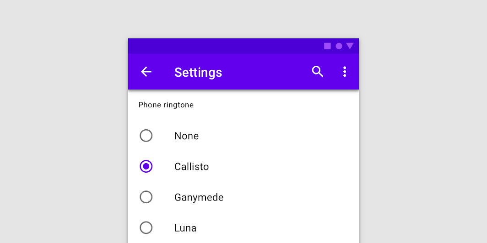

<!--docs:
title: "Radio Buttons"
layout: detail
section: components
iconId: radio_button
path: /catalog/input-controls/radio-buttons/
-->

# 選択コントロール: ラジオボタン

[選択コントロール](https://material.io/components/selection-controls#usage) はユーザーにオプションを選択させるものです。

ラジオボタンは次のような場所で使います。

* リストから一つのオプションを選択する
* 利用できるすべてのオプションを公開する
* 利用できるオプションを折りたためるときには、代わりにより少ないスペースを使用するドロップダウンメニューを使うとこと検討する



**コンテンツ**

* [ラジオボタンの使用法](#using-radio-buttons)
* [ラジオボタン](#radio-buttons)
* [その他のバリエーション](#other-variants)
* [API](#api)
* [Web フレームワークでの使用](#usage-within-web-frameworks)

## <a name="using-radio-buttons"></a>ラジオボタンの使用法

ラジオボタンは集合から一つのオプションをユーザーが選ぶようにします。ユーザーが利用できるすべてのオプションを見る必要があるときはラジオボタンを使ってください。利用可能なオプションを折りたためるようなときは、ドロップダウンメニューを使ってください。そうすると、少ないスペースですませられます。

### ラジオボタンのインストール

```
npm install @material/radio
```

### スタイル

```scss
@use "@material/radio/styles";
@use "@material/form-field";

@include form-field.core-styles;
```

**注意: フォームフィールドスタイルはラジオボタンをフォームフィールドと共に使うときのみ必須です**

### JavaScript のインスタンス化

ラジオボタンは JavaScript なしでも動作しますが、`mdc-radio` 要素上の `MDCRadio` をインスタンス化することによりリップルエフェクトをつけることができます。ラベルにインタラクティブなリップルエフェクトを有効にするには、`mdc-form-field` 要素上の `MDCFormField` のインスタンス化と `input` のように  `MDCRadio` インスタンスを設定しなくてはなりません。

```js
import {MDCFormField} from '@material/form-field';
import {MDCRadio} from '@material/radio';

const radio = new MDCRadio(document.querySelector('.mdc-radio'));
const formField = new MDCFormField(document.querySelector('.mdc-form-field'));
formField.input = radio;
```

**注意: JavaScript をインポートする方法についてのさらなる情報は [JS コンポーネントのインポート](../../docs/importing-js.md) を参照してください。**

### ラジオボタンを操作しやすくする

マテリアルデザイン仕様ではタッチの対象は少なくとも  48px x 48px にすることを勧めています。この要件を満たすために以下のようにラジオボタンに `mdc-radio--touch` クラスを追加してください。

```html
<div class="mdc-touch-target-wrapper">
  <div class="mdc-radio mdc-radio--touch">
    <input class="mdc-radio__native-control" type="radio" id="radio-1" name="radios" checked>
    <div class="mdc-radio__background">
      <div class="mdc-radio__outer-circle"></div>
      <div class="mdc-radio__inner-circle"></div>
    </div>
    <div class="mdc-radio__ripple"></div>
  </div>
</div>
```

隣接している要素において、潜在的に（マージンを縮小するために）タッチ対象が重なってしまうのを避けたい場合は、外側に `mdc-touch-target-wrapper` 要素だけが必要なことに注意してください。

## <a name="radio-buttons"></a>ラジオボタン

ラベルの配置、ラベルが有効な際のリップルのインタラクティブな効果、そしてRTL認識といった機能強化のために MDC Radio は [MDC Form Field](../mdc-form-field) と共に使用することを推奨します。

### ラジオボタンの例

```html
<div class="mdc-form-field">
  <div class="mdc-radio">
    <input class="mdc-radio__native-control" type="radio" id="radio-1" name="radios" checked>
    <div class="mdc-radio__background">
      <div class="mdc-radio__outer-circle"></div>
      <div class="mdc-radio__inner-circle"></div>
    </div>
    <div class="mdc-radio__ripple"></div>
  </div>
  <label for="radio-1">Radio 1</label>
</div>
```

### ラジオボタンの状態

ラジオボタンは選択か非選択にすることができます。ラジオボタンは利用可能、利用不可、ホバー、フォーカス、押下の状態をとります。


## <a name="other-variants"></a>その他のバリエーション

### 利用不可のラジオボタン

ラジオボタンを利用不可にするには、ルート要素に `mdc-radio--disabled` クラスを追加し、`<input>` 要素に `disabled` 属性を設定します。無効なラジオボタンは入力を受け付けず、視覚的にも入力が受け付けられないように見えます。

```html
<div class="mdc-form-field">
  <div class="mdc-radio mdc-radio--disabled">
    <input class="mdc-radio__native-control" type="radio" id="radio-1" name="radios" disabled>
    <div class="mdc-radio__background">
      <div class="mdc-radio__outer-circle"></div>
      <div class="mdc-radio__inner-circle"></div>
    </div>
    <div class="mdc-radio__ripple"></div>
  </div>
  <label for="radio-1">Radio 1</label>
</div>
```

## API

### Sass ミキシン

MDC Checkbox はデフォルトで [MDC Theme](../mdc-theme) の `secondary` カラーを使います。カスタマイズするには以下のミキシンを使います。

ミキシン | 説明
--- | ---
`unchecked-stroke-color($color)` | チェックされていない有効なラジオボタンの枠線の色を設定する。
`checked-stroke-color($color)` | チェックされている有効なラジオボタンの枠線の色を設定する。
`ink-color($color)` | 有効なラジオボタンのインクの色を設定する。
`disabled-unchecked-stroke-color($color)` | チェックされていない無効なラジオボタンの枠線の色を設定する。
`disabled-checked-stroke-color($color)` | チェックされている無効なラジオボタンの枠線の色を設定する。
`disabled-ink-color($color)` | 無効なラジオボタンのインクの色を設定する。
`focus-indicator-color($color)` | フォーカス時のインジケーターの色を設定する。
`touch-target($size, $ripple-size)` | ラジオボタンタッチ対象の大きさをリップルサイズより大きく設定する。パラメータ `$ripple-size` はカスタムリップルサイズのときは必須で、デフォルトは `$ripple-size`。
`ripple-size($size)` | ラジオボタンのカスタムリップルサイズを設定する。
`density($density-scale)` | ラジオボタンの密度スケールを設定する。サポートしている密度スケールは `-3`、`-2`、`-1` そして `0`（デフォルト）。

## `MDCRadio` プロパティとメソッド

プロパティ | 値の型 | 説明
--- | --- | ---
`checked` | Boolean | ラジオボタンのチェック状態を取得/設定する。
`disabled` | Boolean | ラジオボタンが無効かどうかの状態を取得/設定する。セッタはファンデーションの `setDisabled` の代替。
`value` | String | ラジオボタンの値を取得/設定する。

## <a name="usage-within-web-frameworks"></a>Web フレームワーク内での使用

React や Angular のような JavaScript フレームワークを使っているなら、そのフレームワーク用のラジオボタンを作ることができます。ニーズに合わせて、<em>単純な手法: MDC Web の素のコンポーネントをラップする</em> や <em>高度な方法: ファンデーションアダプターを使用する</em> を使うことができます。[ここ](../../docs/integrating-into-frameworks.md) にある説明にしたがってください。

### `MDCRadioAdapter`

メソッド | 説明
--- | ---
`setNativeControlDisabled(disabled: boolean) => void` | インプットの `disabled` プロパティを与えられた値に設定する。
`addClass(className: string) => void` | ート要素にクラスを追加する。
`removeClass(className: string) => void` | ルート要素からクラスを削除する。

### `MDCRadioFoundation`

メソッド | 説明
--- | ---
`setDisabled(disabled: boolean) => void` | ネイティブなコントロールの無効かどうかの値を設定する。
