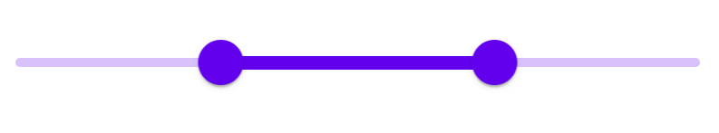

<!--docs:
title: "Sliders"
layout: detail
section: components
excerpt: "Sliders allow users to make selections from a range of values."
iconId: slider
path: /catalog/input-controls/sliders/
-->

# Slider

[Sliders](https://material.io/components/sliders/) はユーザーに値の範囲から選択させるようにするものです。

MDC Slider の実装は1点スライダー（1つのつまみ）と範囲スライダー（2つのつまみ）の両方をサポートします。これはブラウザの `<input type="range">` 要素を背景にしており、完全にアクセス可能で、RTL 対応しています。

**コンテンツ**

*   [スライダーの使用法](#using-sliders)
*   [スライダー](#sliders)
*   [その他のバリエーション](#other-variants)
*   [追加の情報](#additional-information)
*   [API](#api)

## <a name="using-sliders"></a>スライダーの使用

### スライダーのインストール

```
npm install @material/slider
```

### スタイル

```scss
@use "@material/slider";

@include slider.core-styles;
```

### JavaScript のインスタンス化

```js
import {MDCSlider} from '@material/slider';

const slider = new MDCSlider(document.querySelector('.mdc-slider'));
```

**注意**: JavaScript をインポートする方法についてのさらなる情報は [JS コンポーネントのインポート](../../docs/importing-js.md) を参照してください。

### 利用しやすいスライダーの作成

スライダーは `<input>` を背景としており、これは完全にアクセス可能だと言うことです。[ARIA ベースのスライダー](https://www.w3.org/TR/wai-aria-practices/#slider) とは異なり、MDC スライダー は Android 上の TalkBack のようなタッチベースの支援技術を使って調整できます。

仕様にしたがって、以下の属性が `input` 要素の追加されていることを確認してください。

* `value`: 現在の値を表す値。
* `min`: 許容される最小値を表す値。
* `max`: 許容される最大値を表す値。
* `aria-label` もしくは `aria-labelledby`: スライダーのラベル。

値がユーザーフレンドリーでない（例えば曜日を表す数値）なら、以下のように設定します。

* `aria-valuetext`: 例えば「月曜日」のように、この入力属性にスライダーの値を分かりやすくする文字列を設定する。
* `MDCSlider#setValueToAriaValueTextFn` メソッドを通じてスライダーの値を `aria-valuetext` にマッピングする関数を追加する。

## <a name="sliders"></a>スライダー

スライダーには2つのタイプがあります。

1.  [連続スライダー](#continuous-slider)
1.  [離散スライダー](#discrete-slider)

### <a name="continuous-slider"></a>連続スライダー

連続スライダーはユーザーに特定の値を必要とせずに意味のある選択をさせるようにするものです。

注意: 値の刻み幅はデフォルトで 1 です。設定した刻み幅を指定するには、`input` 要素の `step` 属性に値を設定します。


```html
<div class="mdc-slider">
  <input class="mdc-slider__input" type="range" min="0" max="100" value="50" name="volume" aria-label="Continuous slider demo">
  <div class="mdc-slider__track">
    <div class="mdc-slider__track--inactive"></div>
    <div class="mdc-slider__track--active">
      <div class="mdc-slider__track--active_fill"></div>
    </div>
  </div>
  <div class="mdc-slider__thumb">
    <div class="mdc-slider__thumb-knob"></div>
  </div>
</div>
```

#### 連続範囲スライダー



```html
<div class="mdc-slider mdc-slider--range">
  <input class="mdc-slider__input" type="range" min="0" max="70" value="30" name="rangeStart" aria-label="Continuous range slider demo">
  <input class="mdc-slider__input" type="range" min="30" max="100" value="70" name="rangeEnd" aria-label="Continuous range slider demo">
  <div class="mdc-slider__track">
    <div class="mdc-slider__track--inactive"></div>
    <div class="mdc-slider__track--active">
      <div class="mdc-slider__track--active_fill"></div>
    </div>
  </div>
  <div class="mdc-slider__thumb">
    <div class="mdc-slider__thumb-knob"></div>
  </div>
  <div class="mdc-slider__thumb">
    <div class="mdc-slider__thumb-knob"></div>
  </div>
</div>
```

### <a name="discrete-slider"></a>離散スライダー

離散スライダーはつまみを押さえると数値ラベルを表示し、ユーザーに正確な値を選ばせるようにするものです。


離散スライダーを作るには以下のものを追加します。

*   ルート要素の `mdc-slider--discrete` クラス
*   以下に示すような値インジケーター要素（`mdc-slider__value-indicator-container`）。

```html
<div class="mdc-slider mdc-slider--discrete">
  <input class="mdc-slider__input" type="range" min="0" max="100" value="50" name="volume" step="10" aria-label="Discrete slider demo">
  <div class="mdc-slider__track">
    <div class="mdc-slider__track--inactive"></div>
    <div class="mdc-slider__track--active">
      <div class="mdc-slider__track--active_fill"></div>
    </div>
  </div>
  <div class="mdc-slider__thumb">
    <div class="mdc-slider__value-indicator-container">
      <div class="mdc-slider__value-indicator">
        <span class="mdc-slider__value-indicator-text">
          50
        </span>
      </div>
    </div>
    <div class="mdc-slider__thumb-knob"></div>
  </div>
</div>
```

#### 目盛付き離散スライダー

離散スライダーはオプションで目盛を表示することができます。目盛はユーザーがスライダーを動かくすことのできるあらかじめ決められた値を表します。


離散スライダーにメモリを追加するには、以下のものを追加します。

*   ルート要素の `mdc-slider--tick-marks` クラス
*   `mdc-slider__track` 要素の子要素として `mdc-slider__tick-marks` 要素
*   `mdc-slider__tick-marks` 要素の子要素として `mdc-slider__tick-mark--active` 要素と `mdc-slider__tick-mark--inactive` 要素

```html
<div class="mdc-slider mdc-slider--discrete mdc-slider--tick-marks">
  <input class="mdc-slider__input" type="range" min="0" max="100" value="50" name="volume" step="10" aria-label="Discrete slider with tick marks demo">
  <div class="mdc-slider__track">
    <div class="mdc-slider__track--inactive"></div>
    <div class="mdc-slider__track--active">
      <div class="mdc-slider__track--active_fill"></div>
    </div>
    <div class="mdc-slider__tick-marks">
      <div class="mdc-slider__tick-mark--active"></div>
      <div class="mdc-slider__tick-mark--active"></div>
      <div class="mdc-slider__tick-mark--active"></div>
      <div class="mdc-slider__tick-mark--active"></div>
      <div class="mdc-slider__tick-mark--active"></div>
      <div class="mdc-slider__tick-mark--active"></div>
      <div class="mdc-slider__tick-mark--inactive"></div>
      <div class="mdc-slider__tick-mark--inactive"></div>
      <div class="mdc-slider__tick-mark--inactive"></div>
      <div class="mdc-slider__tick-mark--inactive"></div>
      <div class="mdc-slider__tick-mark--inactive"></div>
    </div>
  </div>
  <div class="mdc-slider__thumb">
    <div class="mdc-slider__value-indicator-container">
      <div class="mdc-slider__value-indicator">
        <span class="mdc-slider__value-indicator-text">
          50
        </span>
      </div>
    </div>
    <div class="mdc-slider__thumb-knob"></div>
  </div>
</div>
```

#### 離散範囲スライダー

```html
<div class="mdc-slider mdc-slider--range mdc-slider--discrete">
  <input class="mdc-slider__input" type="range" min="0" max="50" value="20" step="10" name="rangeStart" aria-label="Discrete range slider demo">
  <input class="mdc-slider__input" type="range" min="20" max="100" value="50" step="10" name="rangeEnd" aria-label="Discrete range slider demo">
  <div class="mdc-slider__track">
    <div class="mdc-slider__track--inactive"></div>
    <div class="mdc-slider__track--active">
      <div class="mdc-slider__track--active_fill"></div>
    </div>
  </div>
  <div class="mdc-slider__thumb">
    <div class="mdc-slider__value-indicator-container">
      <div class="mdc-slider__value-indicator">
        <span class="mdc-slider__value-indicator-text">
          20
        </span>
      </div>
    </div>
    <div class="mdc-slider__thumb-knob"></div>
  </div>
  <div class="mdc-slider__thumb">
    <div class="mdc-slider__value-indicator-container">
      <div class="mdc-slider__value-indicator">
        <span class="mdc-slider__value-indicator-text">
          50
        </span>
      </div>
    </div>
    <div class="mdc-slider__thumb-knob"></div>
  </div>
</div>name
```

## <a name="other-variants"></a>その他のバリエーション

### 無効なスライダー

スライダーを無効にするには、以下のものを追加します。

*   ルート要素の `mdc-slider--disabled` クラス
*   input 要素の `disabled` 属性

```html
<div class="mdc-slider mdc-slider--disabled">
  <input class="mdc-slider__input" type="range" min="0" max="100" value="50" step="10" disabled name="volume" aria-label="Disabled slider demo">
  <div class="mdc-slider__track">
    <div class="mdc-slider__track--inactive"></div>
    <div class="mdc-slider__track--active">
      <div class="mdc-slider__track--active_fill"></div>
    </div>
  </div>
  <div class="mdc-slider__thumb">
    <div class="mdc-slider__thumb-knob"></div>
  </div>
</div>
```

## <a name="additional-information"></a>追加の情報

### 指定した範囲と値を持つスライダーの初期化

`MDCSlider` が初期化される際に、input 要素の `min` と `max` と `value` の値があるなら読み込み、コンポーネント内部の `min`、 `max`、 `value` の各プロパティに設定します。

これらの属性を指定した範囲と値のスライダーの初期化に使うには以下のようにします。

```html
<div class="mdc-slider">
  <input class="mdc-slider__input" aria-label="Slider demo" min="0" max="100" value="75">
  <!-- ... -->
</div>
```

### コンポーネン初期化前のスライダー位置の設定

`MDCSlider` が初期化されると、内部変数に基づいてスタイダートラックとつまみの位置が更新されます。コンポーネント初期化前に正しいトラックとつまみの位置を設定するには DOM を以下のようにマークアップします。

- 有効なトラック幅を全トラックに対してのパーセンテージ、すなわち、`(valueEnd - valueStart) / (max - min)` として計算します。これを `rangePercentDecimal` とします。
- 終了つまみの位置を全トラックのパーセンテージとして計算します。これを `thumbEndPercent` とします。終了つまみ（`mdc-slider__thumb`）要素（もしくは RTL レイアウトの際の `right`）のインラインスタイルに `left:calc(<thumbEndPercent>% - 24px)` を設定します。
- *[範囲スライダーのみ]* 開始つまみの内部位置を全トラックに対してのパーセンテージとして計算します。これを `thumbStartPercent` とします。開始つまみ（`mdc-slider__thumb`）要素（もしくは RTL レイアウトの際の `right`）のインラインスタイルに `left:calc(<thumbStartPercent>% - 24px)` を設定します。
- *[範囲スライダーのみ]* これまで計算した `thumbStartPercent` を使って、`mdc-slider__track--active_fill` 要素（もしくは RTL レイアウトの際の `right`）のインラインスタイルに `left:<thumbStartPercent>%` を設定します。

加えて、MDCSlider コンポーネントは `skipInitialUIUpdate` を true に設定して初期化しなくてはなりません。

#### 範囲スライダーの例

以下は `[min, max] = [0, 100]` と `[start, end] = [30, 70]` の内部変数値を持つ範囲スライダーの例です。

```html
<div class="mdc-slider mdc-slider--range">
  <input class="mdc-slider__input" type="range" min="0" max="70" value="30" name="rangeStart" aria-label="Range slider demo">
  <input class="mdc-slider__input" type="range" min="30" max="100" value="70" name="rangeEnd" aria-label="Range slider demo">
  <div class="mdc-slider__track">
    <div class="mdc-slider__track--inactive"></div>
    <div class="mdc-slider__track--active">
      <div class="mdc-slider__track--active_fill"
           style="transform:scaleX(.4); left:30%"></div>
    </div>
  </div>
  <div class="mdc-slider__thumb" style="left:calc(30%-24px)">
    <div class="mdc-slider__thumb-knob"></div>
  </div>
  <div class="mdc-slider__thumb" style="left:calc(70%-24px)">
    <div class="mdc-slider__thumb-knob"></div>
  </div>
</div>
```

## API

### Sass ミキシン

ミキシン | 説明
--- | ---
`track-active-color($color)` | 有効なトラックの色を設定する。
`track-inactive-color($color, $opacity)` | 有効でないトラックの色と不透明度を設定する。
`thumb-color($color)` | つまみの色を設定する。
`thumb-ripple-color($color)` | つまみのリップルの色を設定する。
`tick-mark-active-color($color)` | 有効なトラック上の目盛の色を設定する。
`tick-mark-inactive-color($color)` | 有効でないトラック上の目盛の色を設定する。
`value-indicator-color($color, $opaicty)` | 値インジケーターの色と不透明度を設定する。
`value-indicator-text-color($color, $opaicty)` | 値インジケーターのテキストの色を設定する。

### `MDCSlider` イベント

イベント名 | `event.detail` | 説明
--- | --- | ---
`MDCSlider:change` | `MDCSliderChangeEventDetail` | 値が変わり、ユーザーイベントが完了したときに発生する。ネイティブな `change` イベント (https://developer.mozilla.org/en-US/docs/Web/API/HTMLElement/change_event) の鏡
`MDCSlider:input` | `MDCSliderChangeEventDetail` | ユーザーイベントにより値が変わったときに発生する。ネイティブな `input` イベント (https://developer.mozilla.org/en-US/docs/Web/API/HTMLElement/input_event) の鏡

### `MDCSlider` メソッド

メソッド | 説明
--- | ---
`getValueStart() => number` | 開始つまみの値を取得する（範囲スライダーのみに適用）。
`setValueStart(valueStart: number) => void` | 開始つまみの値を設定する（範囲スライダーのみに適用）。
`getValue() => number` | つまみ（1点スライダーのとき）、または、終了つまみ（範囲スライダーのとき）の値を取得する。
`setValue(value: number) => void` | つまみ（1点スライダーのとき）、または、終了つまみ（範囲スライダーのとき）の値を設定する。
`getDisabled() => boolean` | スライダーの無効状態を取得する。
`setDisabled(disabled: boolean) => void` |スライダーの無効状態を設定する。
`setValueToAriaValueTextFn((mapFn: ((value: number) => string)|null) => void` | スライダーの値とつまみ要素の `aria-valuetext` 属性の値をマッピングする関数を設定します。設定しないと、値が変わっても `aria-valuetext` 属性は変わらない。

### フレームワーク内での使用

React や Angular のような JavaScript フレームワークを使っているなら、そのフレームワーク用のスライダーを作ることができます。ニーズに合わせて、<em>単純な手法: MDC Web の素のコンポーネントをラップする</em> や <em>高度な方法: ファンデーションアダプターを使用する</em> を使うことができます。[ここ](../../docs/integrating-into-frameworks.md) にある説明にしたがってください。

スライダーのファンデーション API の 最新コードのドキュメントに関しては [MDCSliderAdapter](./adapter.ts) と [MDCSliderFoundation](./foundation.ts) を参照してください。
