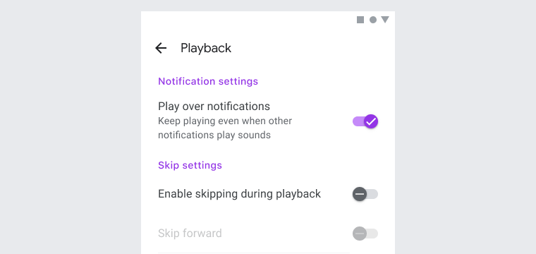

<!--docs:
title: "Switches"
layout: detail
section: components
iconId: switch
path: /catalog/input-controls/switches/
-->

# 選択コントロール: スイッチ

[選択コントロール](https://material.io/components/selection-controls#usage) はユーザーにオプションを選択させるものです。

スイッチはオンまたはオフの単一の状態を切り替えるものです。モバイル上で設定を変えるにあたって優れた方法です。



**コンテンツ**

*   [スイッチの使用法](#using-switches)
*   [スイッチ](#switches)
*   [その他のバリエーション](#other-variants)
*   [API](#api)
*   [Web フレームワークでの使用](#usage-within-web-frameworks)

## <a name="using-switches"></a>スイッチの使用法

スイッチは次のような場所で使います。

*   モバイルやタブレット上での単一項目のオンかオフの切り替え
*   直ちに何かを有効または無効にする

### スイッチのインストール

```
npm install @material/switch
```

### スタイル

```scss
@use '@material/switch/styles';
```

### JavaScript のインスタンス化

スイッチは機能するうえで JavaScript が必須で、そのため、`mdc-switch` 要素上に `MDCSwitch` をインスタンス化する必要があります。

```js
import {MDCSwitch} from '@material/switch';

for (const el of document.querySelectorAll('.mdc-switch')) {
  const switchControl = new MDCSwitch(el);
}
```

**注意: See JavaScript をインポートする方法についてのさらなる情報は [JS コンポーネントのインポート](../../docs/importing-js.md) を参照してください。**

## <a name="switches"></a>スイッチ

### スイッチの例

```html
<button id="basic-switch" class="mdc-switch mdc-switch--unselected" role="switch" aria-checked="false">
  <div class="mdc-switch__track"></div>
  <div class="mdc-switch__handle-track">
    <div class="mdc-switch__handle">
      <div class="mdc-switch__shadow">
        <div class="mdc-elevation-overlay"></div>
      </div>
      <div class="mdc-switch__ripple"></div>
      <div class="mdc-switch__icons">
        <svg class="mdc-switch__icon mdc-switch__icon--on" viewBox="0 0 24 24">
          <path d="M19.69,5.23L8.96,15.96l-4.23-4.23L2.96,13.5l6,6L21.46,7L19.69,5.23z" />
        </svg>
        <svg class="mdc-switch__icon mdc-switch__icon--off" viewBox="0 0 24 24">
          <path d="M20 13H4v-2h16v2z" />
        </svg>
      </div>
    </div>
  </div>
</button>
<label for="basic-switch">off/on</label>
```

### スイッチの状態

スイッチはオンかオフにすることができます。スイッチは利用可能、ホバー、フォーカス、押下の状態をとります。


## <a name="other-variants"></a>その他のバリエーション

### 初期状態が利用不可のスイッチ

スイッチを利用不可にするには `mdc-switch` 要素に `disabled` 要素を追加します。このロジックは `MDCSwitch.disabled` プロパティにより行われますが、初期化の際にクラスと属性を追加することにより FOUC を避けることができます。

```html
<button id="disabled-switch" class="mdc-switch mdc-switch--unselected" role="switch" aria-checked="false" disabled>
  <div class="mdc-switch__track"></div>
  <div class="mdc-switch__handle-track">
    <div class="mdc-switch__handle">
      <div class="mdc-switch__shadow">
        <div class="mdc-elevation-overlay"></div>
      </div>
      <div class="mdc-switch__ripple"></div>
      <div class="mdc-switch__icons">
        <svg class="mdc-switch__icon mdc-switch__icon--on" viewBox="0 0 24 24">
          <path d="M19.69,5.23L8.96,15.96l-4.23-4.23L2.96,13.5l6,6L21.46,7L19.69,5.23z" />
        </svg>
        <svg class="mdc-switch__icon mdc-switch__icon--off" viewBox="0 0 24 24">
          <path d="M20 13H4v-2h16v2z" />
        </svg>
      </div>
    </div>
  </div>
</button>
<label for="disabled-switch">off/on</label>
```

### 初期状態が "on" のスイッチ

スイッチを "on" に切り替えるためには `mdc-switch` 要素に `mdc-switch--selected` クラスと `aria-checked="true"` 属性を追加します。このロジックは `MDCSwitch.selected` メソッドにより行われますが、初期化の際にクラスと属性を追加することにより FOUC を避けることができます。


```html
<button id="selected-switch" class="mdc-switch mdc-switch--selected" role="switch" aria-checked="true">
  <div class="mdc-switch__track"></div>
  <div class="mdc-switch__handle-track">
    <div class="mdc-switch__handle">
      <div class="mdc-switch__shadow">
        <div class="mdc-elevation-overlay"></div>
      </div>
      <div class="mdc-switch__ripple"></div>
      <div class="mdc-switch__icons">
        <svg class="mdc-switch__icon mdc-switch__icon--on" viewBox="0 0 24 24">
          <path d="M19.69,5.23L8.96,15.96l-4.23-4.23L2.96,13.5l6,6L21.46,7L19.69,5.23z" />
        </svg>
        <svg class="mdc-switch__icon mdc-switch__icon--off" viewBox="0 0 24 24">
          <path d="M20 13H4v-2h16v2z" />
        </svg>
      </div>
    </div>
  </div>
</button>
<label for="selected-switch">off/on</label>
```

## API

### CSS クラス

| CSS クラス                  | 説明                                    |
| -------------------------- | ---------------------------------------------- |
| `mdc-switch`               | 必須。親要素につける。             |
| `mdc-switch--unselected`   | オプション。スイッチを非選択 ("off")　にする。 |
| `mdc-switch--selected`     | オプション。スイッチを選択 ("on")　にする。 |
| `mdc-switch__track`        | 必須。トラック要素につける。 |
| `mdc-switch__handle-track` | 必須。トラックのハンドルのトラック要素につける。 |
| `mdc-switch__handle`       | 必須。ハンドル要素につける。 |
| `mdc-switch__shadow`       | 必須。シャドウ効果をつける。 |
| `mdc-elevation-overlay`    | 必須。ダークモードでのシャドウ効果のオーバーレイにつける。 |
| `mdc-switch__ripple`       | 必須。リップル効果をつける。 |
| `mdc-switch__icons`        | 必須。アイコンにつける。 |
| `mdc-switch__icon`         | 必須。アイコン要素につける。 |
| `mdc-switch__icon--on`     | 必須。オンアイコンにつける。 |
| `mdc-switch__icon--off`    | 必須。オフアイコンにつける。 |

### テーマミキシン

スイッチは `theme()` ミキシンと [MDC Theme](../mdc-theme) 文字列 (`primary` のような) もしくはテーマのキーのその他の値を使ってカスタマイズできます。

```scss
@use '@material/switch';
@use '@material/theme/color-palette';
@use '@material/theme/shadow-dom';

// Include for IE11 support
// @include shadow-dom.enable-css-selector-fallback-declarations(true);

.my-switch {
  @include switch.theme((
    selected-handle-color: color-palette.$teal-600,
    selected-track-color: color-palette.$teal-300,
  ));
}
```

利用可能なキーとビルドインテーマについては [theme file](_switch-theme.scss) を見てください。

### `MDCSwitch` プロパティ

| プロパティ   | 値の型 | 説明                                        |
| ---------- | ---------- | -------------------------------------------------- |
| `disabled` | Boolean    | スイッチが無効かどうかを示す。 |
| `selected` | Boolean    | true ならスイッチは on。false ならスイッチは off。 |

## Web フレームワークでの使用

React や Angular のような JavaScript フレームワークを使っているなら、そのフレームワーク用のスイッチを作ることができます。ニーズに合わせて、<em>単純な手法: MDC Web の素のコンポーネントをラップする</em> や <em>高度な方法: ファンデーションアダプターを使用する</em> を使うことができます。[ここ](../../../docs/integrating-into-frameworks.md) にある説明にしたがってください。

スイッチのファンデーション API の最新のコードのドキュメントについては [MDCSwitchAdapter](./adapter.ts) and [MDCSwitchFoundation](./foundation.ts) を参照してください。
