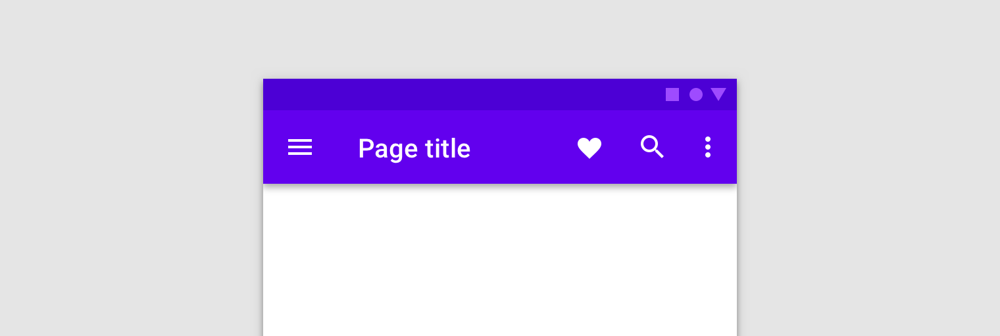
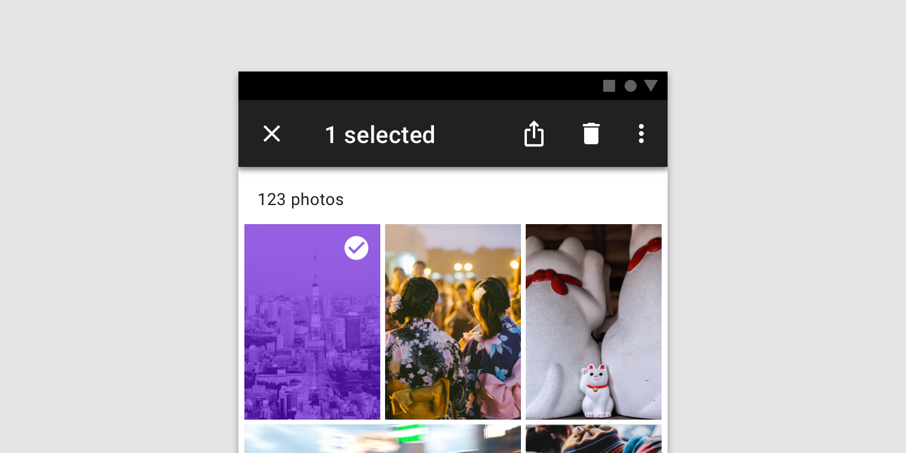

<!--docs:
title: "Top App Bar"
layout: detail
section: components
excerpt: "A container for items such as application title, navigation icon, and action items."
iconId: toolbar
path: /catalog/top-app-bar/
-->

# Top app bar

top app bar は現在の画面に関連するコンテンツと操作を提供します。これはブランディング、画面タイトル、ナビベーションや操作に使用されます。

トップアプリバーには2つのタイプがあります。

1. [通常のトップアプリバー](#regular-top-app-bar)
1. [文脈依存操作バー](#contextual-action-bar)

通常のトップアプリバーは文脈依存操作バーに変換することが可能です。




## トップアプリバーを使う

### インストール

```
npm install @material/top-app-bar
```

### スタイル

```scss
@use "@material/icon-button";
@use "@material/top-app-bar/mdc-top-app-bar";

@include icon-button.core-styles;
```

### JavaScript のインスタンス化

```js
import {MDCTopAppBar} from '@material/top-app-bar';

// インスタンス化
const topAppBarElement = document.querySelector('.mdc-top-app-bar');
const topAppBar = new MDCTopAppBar(topAppBarElement);
```

**注意: JavaScript をインポートする方法についてのさらなる情報は [JS コンポーネントのインポート](../../docs/importing-js.md) を参照してください。**

## <a name="regular-top-app-bar"></a>通常のトップアプリバー

トップアプリバーは現在の画面に関連するコンテンツと操作を提供します。これはブランディング、画面タイトル、ナビベーションや操作に使用されます。

### 通常のトップアプリバーの例

```html
<header class="mdc-top-app-bar">
  <div class="mdc-top-app-bar__row">
    <section class="mdc-top-app-bar__section mdc-top-app-bar__section--align-start">
      <button class="material-icons mdc-top-app-bar__navigation-icon mdc-icon-button" aria-label="Open navigation menu">menu</button>
      <span class="mdc-top-app-bar__title">Page title</span>
    </section>
    <section class="mdc-top-app-bar__section mdc-top-app-bar__section--align-end" role="toolbar">
      <button class="material-icons mdc-top-app-bar__action-item mdc-icon-button" aria-label="Favorite">favorite</button>
      <button class="material-icons mdc-top-app-bar__action-item mdc-icon-button" aria-label="Search">search</button>
      <button class="material-icons mdc-top-app-bar__action-item mdc-icon-button" aria-label="Options">more_vert</button>
    </section>
  </div>
</header>
<main class="mdc-top-app-bar--fixed-adjust">
  App content
</main>
```

#### メニューアイコン

トップアプリバーはナビゲーションアイコンの反対側に配置した操作アイテムを入れることができます。適切なスタイルを適応するには `mdc-top-app-bar__navigation-icon` 要素と `mdc-top-app-bar__action-item` 要素の両方に `mdc-icon-button` クラスをつけなくてはなりません。

アイコンの詳細なドキュメントについては、[mdc-icon-button ドキュメント](../mdc-icon-button/README.md) を参照してください。

## <a name="contextual-action-bar"></a>文脈依存操作バー

トップアプリバーを文脈依存操作バーに変換して、選択された項目に文脈依存の操作を適用することができます。例えば、ギャラリーからユーザーが写真選択した際に、トップアプリバーを選択された写真に関連する操作をもつ文脈依存操作バーに変えられます。

トップアプリバーを文脈依存操作バーに変換する際には、以下の変更が起きます。

* バーの色が変わる
* ナビゲーションアイコンが閉じるアイコンに置き換わる
* トップアプリバーのタイトルテキストが文脈依存操作バーのテキストに変わる
* トップアプリバーの操作が文脈依存操作バーの操作に置き換わる
* 閉じると、文脈依存操作バーがトップアプリバーに戻る

### 文脈依存操作バーの例

次の例は、文脈依存のタイトル、閉じるアイコン、2つの文脈依存操作アイコン、そしてオーバーフローメニューを持つ文脈依存操作バーを表示します。

```html
<header class="mdc-top-app-bar">
  <div class="mdc-top-app-bar__row">
    <section class="mdc-top-app-bar__section mdc-top-app-bar__section--align-start">
      <button class="material-icons mdc-top-app-bar__navigation-icon mdc-icon-button" aria-label="Close">close</button>
      <span class="mdc-top-app-bar__title">Contextual title</span>
    </section>
    <section class="mdc-top-app-bar__section mdc-top-app-bar__section--align-end" role="toolbar">
      <button class="material-icons mdc-top-app-bar__action-item mdc-icon-button" aria-label="Share">share</button>
      <button class="material-icons mdc-top-app-bar__action-item mdc-icon-button" aria-label="Delete">delete</button>
      <button class="material-icons mdc-top-app-bar__action-item mdc-icon-button" aria-label="Open menu">more_vert</button>
    </section>
  </div>
</header>
<main class="mdc-top-app-bar--fixed-adjust">
  App content
</main>
````

## その他のバリエーション

### 短いもの

短いトップアプリバーはスクロール時にナビゲーションアイコン側に折りたたむことができるトップアプリバーです。

```html
<header class="mdc-top-app-bar mdc-top-app-bar--short">
  <div class="mdc-top-app-bar__row">
    <section class="mdc-top-app-bar__section mdc-top-app-bar__section--align-start">
      <button class="material-icons mdc-top-app-bar__navigation-icon mdc-icon-button">menu</button>
      <span class="mdc-top-app-bar__title">Title</span>
    </section>
    <section class="mdc-top-app-bar__section mdc-top-app-bar__section--align-end" role="toolbar">
      <button class="material-icons mdc-top-app-bar__action-item mdc-icon-button" aria-label="Bookmark this page">bookmark</button>
    </section>
  </div>
</header>
<main class="mdc-top-app-bar--short-fixed-adjust">
  App content
</main>
```

**注意: 短いトップアプリバーは1つ以下の操作アイテムと共に使う必要があります。**

### 短いもの - 常にたたまれている

コンポーネントをインスタンス化する前に `mdc-top-app-bar--short-collapsed` を適用すると常に折りたたまれて表示されるように設定することができます。

```html
<header class="mdc-top-app-bar mdc-top-app-bar--short mdc-top-app-bar--short-collapsed">
  ...
</header>
<main class="mdc-top-app-bar--short-fixed-adjust">
  App content
</main>
```

### 固定されたもの

固定されたトップアプリバーはスクロール時にページの上部にとどまり、コンテンツの上に表示されます。

```html
<header class="mdc-top-app-bar mdc-top-app-bar--fixed">
  ...
</header>
<main class="mdc-top-app-bar--fixed-adjust">
  App content
</main>
```

### 目立つもの

目立つトップアプリバーはより高さのあるものです。

```html
<header class="mdc-top-app-bar mdc-top-app-bar--prominent">
  ...
</header>
<main class="mdc-top-app-bar--prominent-fixed-adjust">
  App content
</main>
```

### 高密度

高密度トップアプリバーはより高さのないものです。

```html
<header class="mdc-top-app-bar mdc-top-app-bar--dense">
  ...
</header>
<main class="mdc-top-app-bar--dense-fixed-adjust">
  App content
</main>
```

## スタイルのカスタマイズ

### CSS クラス

クラス | 説明
--- | ---
`mdc-top-app-bar` | 必須。
`mdc-top-app-bar--fixed` | 固定されたトップアプリバーとしてトップアプリバーをスタイルするために使われるクラス。
`mdc-top-app-bar--fixed-adjust` | 通常のトップアプリバーと固定されたトップアップバーがコンテンツを隠すことを防ぐために標準のトップアップバーおよび固定されたトップアプリバーの下のコンテンツをスタイルするのに使われるクラス。
`mdc-top-app-bar--prominent` | 目立つトップアプリバーとしてトップアプリバーをスタイルするために使われるクラス。
`mdc-top-app-bar--prominent-fixed-adjust` | トップアプリバーがコンテンツを隠すことを防ぐために目立つトップアプリバーの下のコンテンツをスタイルするのに使われるクラス。
`mdc-top-app-bar--dense` | 高密度トップアプリバーとしてトップアプリバーをスタイルするために使われるクラス。
`mdc-top-app-bar--dense-fixed-adjust` | トップアプリバーがコンテンツを隠すことを防ぐために高密度トップアプリバーの下のコンテンツをスタイルするのに使われるクラス。
`mdc-top-app-bar--dense-prominent-fixed-adjust` | トップアプリバーがコンテンツを隠すことを防ぐために、高密度と目立つの両方を指定したトップアプリバーの下のコンテンツをスタイルするのに使われるクラス。
`mdc-top-app-bar--short` | 短いトップアプリバーとしてトップアプリバーをスタイルするために使われるクラス。
`mdc-top-app-bar--short-collapsed` | 短いトップアプリバーが折りたたまれていることを表すのに使われるクラス。
`mdc-top-app-bar--short-fixed-adjust` | トップアプリバーがコンテンツを隠すことを防ぐために短いトップアプリバーの下のコンテンツをスタイルするのに使われるクラス。

### Sass ミキシン

ミキシン | 説明
--- | ---
`ink-color($color)` | トップアプリバーのインク色を設定する。
`icon-ink-color($color)` | トップアプリバーのアイコンのインク色を設定する。
`fill-color($color)` | トップアプリバーの塗りの色を設定する。
`fill-color-accessible($color)` | トップアプリバーの塗りの色を設定し、自動的にハイコントラストなインク色を設定する。
`short-shape-radius($radius, $rtl-reflexive)` | 短いトップアプリバーの（折りたたまれているときの）角の丸みを指定した半径のサイズに設定する。RTL コンテキスト内で、半径の値をひっくり返すには `$rtl-reflexive` を true に設定する。デフォルトは true。

## `MDCTopAppBar` プロパティとメソッド

メソッド | 説明
--- | ---
`setScrollTarget(target: element) => void` | 異なる DOM ノード（デフォルトは window）にスクロールの対象を設定する。

### イベント

イベント | イベントデータの構造 | 説明
--- | --- | ---
`MDCTopAppBar:nav` | None | ナビゲーションアイコンがクリックされたときに発生する。

## Web フレームワーク内での使用

React や Angular のような JavaScript フレームワークを使っているなら、そのフレームワーク用のトップアプリバーを作ることができます。ニーズに合わせて、<em>単純な手法: MDC Web の素のコンポーネントをラップする</em> や <em>高度な方法: ファンデーションアダプターを使用する</em> を使うことができます。[ここ](../../docs/integrating-into-frameworks.md) にある説明にしたがってください。

### `MDCTopAppBarAdapter`

メソッド | 説明
--- | ---
`addClass(className: string) => void` | コンポーネントのルート要素にクラスを追加する。
`removeClass(className: string) => void` | コンポーネントのルート要素からクラスを削除する。
`hasClass(className: string) => boolean` | コンポーネントのルート要素が与えられたクラス名を持つかどうかをチェックする。
`setStyle(property: string, value: string) => void` | ルート要素の指定した CSS プロパティに与えられた値を設定する。
`getTopAppBarHeight() => number` | トップアプリバーの高さをピクセルで取得する。
`getViewportScrollY() => number` | ページトップから body のコンテンツがスクロールしたピクセル数を取得する。
`getTotalActionItems() => number` | トップアプリバー上の操作アイテムの数を取得する。
`notifyNavigationIconClicked() => void` | ナビゲーションアイコンがクリックされたときにカスタムイベント `MDCTopAppBar:nav` を発生させる。

### ファンデーション

#### `MDCTopAppBarBaseFoundation`、`MDCTopAppBarFoundation`、`MDCFixedTopAppBarFoundation` および `MDCShortTopAppBarFoundation`

すべてのファンデーションは以下のメソッドを提供します。

メソッド | 説明
--- | ---
`handleTargetScroll() => void` | 指定したスクロールターゲット（デフォルトは `window`）の `scroll` イベントをハンドリングする。
`handleWindowResize() => void` | ウィンドウの `resize` イベントをハンドリングする。
`handleNavigationClick() => void` | ナビゲーションアイコンの `click` イベントをハンドリングする。

#### `MDCShortTopAppBarFoundation`

上で挙げたメソッドに加えて、短いトップアプリバーでは以下のパブリックなメソッドとプロパティが提供されています。

メソッド | 説明
--- | ---
`setAlwaysCollapsed(value: boolean) => void` | `value` が `true` のとき、短いトップアプリバーは常に折りたたまれる。
`getAlwaysCollapsed() => boolean` | 短いトップアプリバーが「常に折りたたまれた」状態であるかどうかを取得する。

プロパティ | 値の型 | 説明
--- | --- | ---
`isCollapsed` | `boolean` (読取専用) | 短いトップアプリバーが折りたたまれた状態かどうかを示す。
